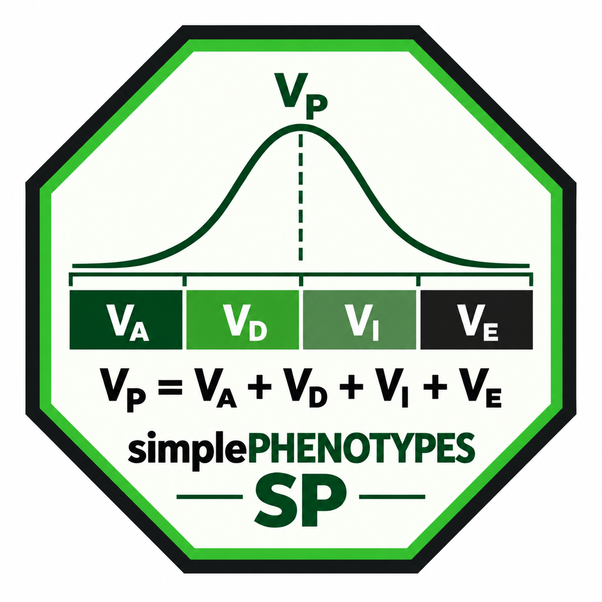

<!-- README.md is generated from README.Rmd. Please edit that file -->

<!-- badges: start -->

[](https://CRAN.R-project.org/package=simplePHENOTYPES)
[](https://github.com/samuelbfernandes/simplePHENOTYPES/issues)
[](https://opensource.org/licenses/MIT)
[](https://cran.r-project.org/package=simplePHENOTYPES)
[](https://cran.r-project.org/package=simplePHENOTYPES)
[](https://github.com/samuelbfernandes/simplePHENOTYPES)
[](https://doi.org/10.1186/s12859-020-03804-y)
<!-- badges: end -->

<p align="center">


</p>

Simulation of pleiotropic, linked and epistatic phenotypes from real
marker data. Version 2 adds a composable grammar for building genetic
architectures, control of the genetic correlation between traits, and
multi-generation crossing, so a mapping population can be simulated from
real founders and then phenotyped.

<a href="SP_logo.png"></a>

### Contents

- [Installation](#installation)
- [Quick start](#quick-start)
- [Building an architecture](#building-an-architecture)
- [Heritability](#heritability)
- [Correlated traits](#correlated-traits)
- [Linked but not pleiotropic](#linked-but-not-pleiotropic)
- [Breeding populations](#breeding-populations)
- [Reading genotype data](#reading-genotype-data)
- [Documentation](#documentation)
- [Citation](#citation)
- [Contact](#contact)

# Installation

Install a precompiled binary from
[R-universe](https://samuelbfernandes.r-universe.dev) — nothing to
compile, no Rust needed (Windows and macOS):

``` r
install.packages("simplePHENOTYPES",
                 repos = c("https://samuelbfernandes.r-universe.dev",
                           "https://cloud.r-project.org"))
```

<details>

<summary>

Building from source instead (Linux, or <code>install_github()</code>)
</summary>

Part of the package is written in Rust, so building it *from source*
needs a **Rust toolchain** (`cargo` and `rustc` \>= 1.65) — install it
once from <https://rustup.rs>, then:

``` r
devtools::install_github("samuelbfernandes/simplePHENOTYPES", build_vignettes = TRUE)
```

</details>

Two Bioconductor packages, **SNPRelate** and **gdsfmt**, are *optional*
(`Suggests`): they are only needed to read GDS / VCF / PLINK BED/PED
input, or to run the legacy `create_phenotypes()` engine. The v2 grammar
works without them on HapMap, the bundled numeric object, and plain
−1/0/1 matrices. Install them only if you need those formats:

``` r
if (!requireNamespace("BiocManager", quietly = TRUE)) install.packages("BiocManager")
BiocManager::install(c("SNPRelate", "gdsfmt"))
```

# Quick start

``` r
library(simplePHENOTYPES)
data("SNP55K_maize282_maf04")
geno <- SNP55K_maize282_maf04
```

A simulation starts with `simulate_phenotype()` and gains variance
components as layers. The pipe runs eagerly, so every object already
carries realized phenotypes.

``` r
ph <- simulate_phenotype(geno, h2 = 0.5, seed = 1) |>
  additive(n_qtn = 3)
ph
#> <phenotype_sim>  (realized · long format)
#>   Genotypes: geno   Traits: 1   Architecture: independent   Seed: 1
#>   Variance partition (proportions of V_P):
#>     additive   0.50   (3 QTNs, geometric)
#>     residual   0.50
#>   Requested genetic share = 0.50   realized H² = 0.48
```

``` r
head(phenotypes_long(ph))
#>      id   trait rep      value
#> 1  4226 Trait_1   1  1.8462725
#> 2  4722 Trait_1   1  1.1217471
#> 3 33-16 Trait_1   1 -0.2158284
#> 4 38-11 Trait_1   1  0.4638002
#> 5  A188 Trait_1   1 -0.6479153
#> 6  A239 Trait_1   1  0.8836147
```

# Building an architecture

`additive()`, `dominance()`, `epistasis()` and `vqtl()` are the four
layers. `dominance()` and `vqtl()` reuse the additive QTNs unless told
otherwise.

``` r
simulate_phenotype(geno, h2 = 0.5, seed = 2) |>
  additive(prop = 0.3, n_qtn = 5) |>
  dominance(prop = 0.1) |>
  epistasis(prop = 0.1, n_pairs = 2)
#> <phenotype_sim>  (realized · long format)
#>   Genotypes: geno   Traits: 1   Architecture: independent   Seed: 2
#>   Variance partition (proportions of V_P):
#>     additive   0.30   (5 QTNs, geometric)
#>     dominance  0.10   (same QTNs as additive)
#>     epistasis  0.10   (2 pairs, 2-way)
#>     residual   0.50
#>   Requested genetic share = 0.50   realized H² = 0.51
```

# Heritability

Set `h2` once, in `simulate_phenotype()`. With a single `additive()`
layer the whole of `h2` goes to it, so `prop` can be left out:

``` r
simulate_phenotype(geno, h2 = 0.6, seed = 3) |>
  additive(n_qtn = 4)
#> <phenotype_sim>  (realized · long format)
#>   Genotypes: geno   Traits: 1   Architecture: independent   Seed: 3
#>   Variance partition (proportions of V_P):
#>     additive   0.60   (4 QTNs, geometric)
#>     residual   0.40
#>   Requested genetic share = 0.60   realized H² = 0.59
```

With several layers, give each a `prop` and let them add up to `h2`:

``` r
simulate_phenotype(geno, h2 = 0.6, seed = 3) |>
  additive(prop = 0.4, n_qtn = 4) |>
  dominance(prop = 0.2)
#> <phenotype_sim>  (realized · long format)
#>   Genotypes: geno   Traits: 1   Architecture: independent   Seed: 3
#>   Variance partition (proportions of V_P):
#>     additive   0.40   (4 QTNs, geometric)
#>     dominance  0.20   (same QTNs as additive)
#>     residual   0.40
#>   Requested genetic share = 0.60   realized H² = 0.58
```

Proportions that overshoot `h2` are an error, so the variance budget
cannot drift by accident. These are marginal component variances.
Additive, dominance, and epistatic design terms are not
Fisher/NOIA-orthogonalized, so their finite-sample covariances can make
realized broad-sense heritability differ slightly from the requested
sum; the printed object reports both.

`vqtl()` is different: its `prop` allocates a genotype-dependent
residual component and is not included in broad-sense heritability.

# Correlated traits

`architecture = "pleiotropy"` puts the same QTNs behind several traits,
and `cor` sets the **genetic** correlation directly. This works for any
number of traits, with a single value for all pairs or a full matrix.

``` r
two <- simulate_phenotype(geno, architecture = "pleiotropy", n_traits = 2,
                          cor = 0.6, h2 = 0.5, seed = 4) |>
  additive(n_qtn = 100)
#> In addition to citing "Fernandes, S.B., Lipka, A.E. simplePHENOTYPES: SIMulation of pleiotropic, linked and epistatic phenotypes. BMC Bioinformatics 21, 491 (2020). https://doi.org/10.1186/s12859-020-03804-y" please cite Prado et al. (in preparation) when controlling the correlation in the pleiotropic architecture.
#> This message is displayed once per session.
two
#> <phenotype_sim>  (realized · long format)
#>   Genotypes: geno   Traits: 2   Architecture: pleiotropy   Seed: 4
#>   Variance partition (proportions of V_P):
#>     additive   [0.50, 0.50]   (100 QTNs, geometric)
#>     residual   [0.50, 0.50]
#>   Requested genetic share = [0.50, 0.50]   realized H² = [0.47, 0.53]
```

``` r
target <- matrix(c( 1.0,  0.8, -0.4,
                    0.8,  1.0, -0.2,
                   -0.4, -0.2,  1.0), 3, 3)

simulate_phenotype(geno, architecture = "pleiotropy", n_traits = 3,
                   cor = target, h2 = 0.5, seed = 5) |>
  additive(n_qtn = 300)
#> <phenotype_sim>  (realized · long format)
#>   Genotypes: geno   Traits: 3   Architecture: pleiotropy   Seed: 5
#>   Variance partition (proportions of V_P):
#>     additive   [0.50, 0.50, 0.50]   (300 QTNs, geometric)
#>     residual   [0.50, 0.50, 0.50]
#>   Requested genetic share = [0.50, 0.50, 0.50]   realized H² = [0.52, 0.49, 0.47]
```

The realized correlation is the target in expectation, and tightens as
QTNs are added; the [complete
reference](docs/complete-reference.md#4-genetic-architectures) shows how
closely, and what happens when a request is not attainable.

Partial pleiotropy — only part of each trait’s genetic variance shared —
comes from `pi`:

``` r
simulate_phenotype(geno, architecture = "pleiotropy", n_traits = 3,
                   cor = 0.5, pi = c(1, 0.8, 0.6), h2 = 0.5, seed = 6) |>
  additive(n_qtn = 100)
#> <phenotype_sim>  (realized · long format)
#>   Genotypes: geno   Traits: 3   Architecture: pleiotropy   Seed: 6
#>   Variance partition (proportions of V_P):
#>     additive   [0.50, 0.50, 0.50]   (100 QTNs, geometric)
#>     residual   [0.50, 0.50, 0.50]
#>   Requested genetic share = [0.50, 0.50, 0.50]   realized H² = [0.51, 0.47, 0.46]
```

# Linked but not pleiotropic

`architecture = "ld"` gives two traits **distinct** causal loci that sit
in linkage disequilibrium, so the traits covary through linkage rather
than a shared locus — the spurious-pleiotropy scenario. It is a
two-trait construct; `ld_type = "direct"` (the default) links the two
traits’ causal SNPs to each other, while `"indirect"` links each to a
shared hidden cause-of-LD locus.

``` r
simulate_phenotype(geno, architecture = "ld", n_traits = 2,
                   h2 = 0.4, seed = 7) |>
  additive(n_qtn = 3)
#> <phenotype_sim>  (realized · long format)
#>   Genotypes: geno   Traits: 2   Architecture: ld   Seed: 7
#>   Variance partition (proportions of V_P):
#>     additive   [0.40, 0.40]   (3 QTNs, geometric)
#>     residual   [0.60, 0.60]
#>   Requested genetic share = [0.40, 0.40]   realized H² = [0.40, 0.39]
```

# Breeding populations

Meiosis is simulated directly, so a pedigree can be built from real
founders and phenotyped without leaving the package. Recombination uses
the genetic map in the `cm` column.

``` r
pop <- as_population(geno, individuals = c("33-16", "38-11"))
f1  <- cross(pop[1], pop[2], n = 1, seed = 11)
#> In addition to citing "Fernandes, S.B., Lipka, A.E. simplePHENOTYPES: SIMulation of pleiotropic, linked and epistatic phenotypes. BMC Bioinformatics 21, 491 (2020). https://doi.org/10.1186/s12859-020-03804-y" please cite Toledo, F.H., Perez-Rodriguez, P., Crossa, J. and Burgueno, J. (2019). isqg: A Binary Framework for in Silico Quantitative Genetics. G3 9(8):2425-2428, doi:10.1534/g3.119.400373 when using the crossing pipelines (cross, selfcross, double_haploid).
#> This message is displayed once per session.
f2  <- selfcross(f1, n = 200, seed = 12)
dh  <- double_haploid(f1, n = 200, seed = 13)

# Doubled haploids are completely homozygous by construction
any(dosages(dh) == 0)
#> [1] FALSE
```

A `Population` is accepted anywhere `simulate_phenotype()` takes
genotypes:

``` r
simulate_phenotype(f2, h2 = 0.6, seed = 14) |>
  additive(n_qtn = 5)
#> <phenotype_sim>  (realized · long format)
#>   Genotypes: <Population: selfcross(prog_1)>   Traits: 1   Architecture: independent   Seed: 14
#>   Variance partition (proportions of V_P):
#>     additive   0.60   (5 QTNs, geometric)
#>     residual   0.40
#>   Requested genetic share = 0.60   realized H² = 0.63
```

Meiosis needs distances in centiMorgans. `SNP55K_maize282_maf04` ships
with a **synthetic** map in `cm` — modelled from the physical positions
by `synthetic_map()`, not taken from a published maize linkage map, and
not to be quoted as measured recombination distance. Supply your own map
when you have one:

``` r
geno$cm <- synthetic_map(geno$chr, geno$pos)
```

# Reading genotype data

`as_numeric()` converts HapMap, VCF, GDS or PLINK bed/ped input into the
numeric format used above.

``` r
num <- as_numeric("my_genotypes.hmp.txt", to_r = TRUE)
```

# Testing and coverage

The v2 grammar, the isqg meiosis port, and the crossing functions have a
comprehensive unit suite (run `devtools::test()`). Test coverage of the
new v2 code (`grammar_*`, `arch_*`, `effects_*`, `io_*`, `cross_*`) is
~84%; the frozen `create_phenotypes()` engine is bugfix-only and guarded
by a v1.3.0 regression harness rather than by broad unit tests, which is
why whole-package coverage is lower.

# Documentation

**[Complete reference: every option in one
place](docs/complete-reference.md)** — every version 2 option exercised
end to end, readable here on GitHub without installing anything.

Once the package is installed:

``` r
vignette("complete-reference")      # every option, exhaustively
vignette("simplePHENOTYPES-v2")     # the grammar, in full
vignette("breeding-populations")    # crossing, selfing, doubled haploids
vignette("genetic-maps")            # recombination distances
vignette("simplePHENOTYPES")        # original create_phenotypes() interface
```

# Legacy: `create_phenotypes()`

`create_phenotypes()` is the original interface. It still works and is
still maintained, but it is superseded by the grammar shown above. See
**[Original implementation of
create_phenotypes](docs/original-create-phenotypes.md)** for how to use
it.

# Citation

Fernandes, S.B. and Lipka, A.E. (2020). simplePHENOTYPES: SIMulation of
Pleiotropic, Linked and Epistatic PHENOTYPES. *BMC Bioinformatics* 21,
491. <https://doi.org/10.1186/s12859-020-03804-y>

When you control the genetic correlation in the pleiotropy architecture
(the `cor` argument), also cite Prado *et al.* (in preparation), which
describes that algorithm. `citation("simplePHENOTYPES")` lists both.

``` r
citation("simplePHENOTYPES")
```

# Contact

Samuel B Fernandes fernandessb101 \[at\] gmail \[dot\] com
