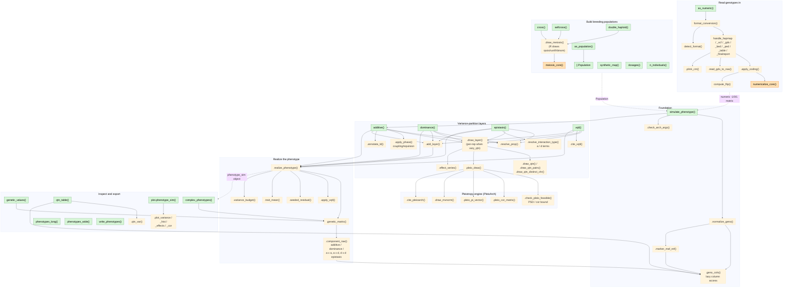
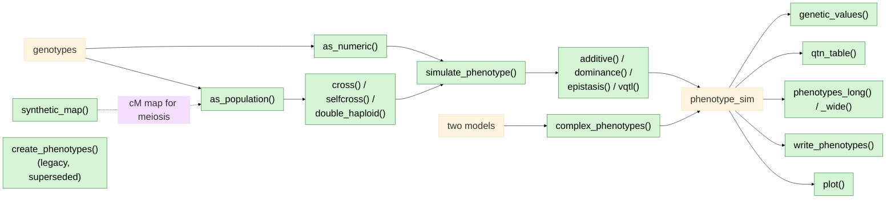

# simplePHENOTYPES — function map

How the pieces fit together and where each function is used. Renders on GitHub,
in VS Code's Markdown preview, and in the RStudio viewer.

**Legend:** green = user-facing (exported); plain = internal helper;
orange = Rust core; grey = frozen legacy engine.

## The whole picture

```drawio
<mxfile>
  <diagram id="ugkwWPnkblt5jk143LMh" name="Page-1">
    <mxGraphModel dx="2" dy="1" grid="0" gridSize="10" guides="1" tooltips="0" connect="0" arrows="0" fold="0" page="0" pageScale="1" pageWidth="850" pageHeight="1100" math="0" shadow="0">
      <root>
        <mxCell id="phE01TtkZUTpKLOzlSEs-0" />
        <mxCell id="phE01TtkZUTpKLOzlSEs-1" parent="phE01TtkZUTpKLOzlSEs-0" />
        <UserObject label="" mermaidData="{&#xa;  &quot;data&quot;: &quot;%%{init: {&#39;theme&#39;:&#39;base&#39;, &#39;themeVariables&#39;: {&#39;fontSize&#39;:&#39;26px&#39;}, &#39;flowchart&#39;: {&#39;nodeSpacing&#39;:45,&#39;rankSpacing&#39;:60,&#39;padding&#39;:12}}}%%\nflowchart TB\n  classDef api fill:#d6f5d6,stroke:#2e7d32,color:#000;\n  classDef rust fill:#ffe0b2,stroke:#e65100,color:#000;\n  classDef legacy fill:#e0e0e0,stroke:#616161,color:#000;\n\n  %% ---------------- INPUT ----------------\n  subgraph IN[\&quot;Read genotypes in\&quot;]\n    direction TB\n    asnum[\&quot;as_numeric()\&quot;]:::api --&gt; fconv[\&quot;format_conversion()\&quot;]\n    fconv --&gt; dfmt[\&quot;detect_format()\&quot;]\n    fconv --&gt; handlers[\&quot;handle_hapmap / _vcf / _gds /&lt;br/&gt;_bed / _ped / _table / _finalreport\&quot;]\n    handlers --&gt; plinkcm[\&quot;.plink_cm()\&quot;]\n    handlers --&gt; gds2raw[\&quot;.read_gds_to_raw()\&quot;]\n    handlers --&gt; apcode[\&quot;.apply_coding()\&quot;]\n    apcode --&gt; cflip[\&quot;compute_flip()\&quot;]\n    apcode --&gt; ncore[\&quot;numericalize_core()\&quot;]:::rust\n  end\n\n  %% ---------------- CROSSING ----------------\n  subgraph CR[\&quot;Build breeding populations\&quot;]\n    direction TB\n    aspop[\&quot;as_population()\&quot;]:::api\n    smap[\&quot;synthetic_map()\&quot;]:::api\n    cross[\&quot;cross()\&quot;]:::api --&gt; dmei[\&quot;.draw_meiosis()&lt;br/&gt;(R draws rpois/runif/rbinom)\&quot;]\n    self[\&quot;selfcross()\&quot;]:::api --&gt; dmei\n    dh[\&quot;double_haploid()\&quot;]:::api --&gt; dmei\n    dmei --&gt; mcore[\&quot;meiosis_core()\&quot;]:::rust\n    dose[\&quot;dosages()\&quot;]:::api\n    nind[\&quot;n_individuals()\&quot;]:::api\n    subpop[\&quot;[.Population\&quot;]:::api\n  end\n\n  %% ---------------- FOUNDATION ----------------\n  subgraph FD[\&quot;Foundation\&quot;]\n    direction TB\n    simp[\&quot;simulate_phenotype()\&quot;]:::api --&gt; normg[\&quot;.normalize_geno()\&quot;]\n    simp --&gt; chkarch[\&quot;.check_arch_args()\&quot;]\n    normg --&gt; gcols[\&quot;.geno_cols()&lt;br/&gt;lazy column access\&quot;]\n    normg --&gt; mafr[\&quot;.marker_maf_ref()\&quot;]\n    mafr --&gt; gcols\n  end\n\n  %% ---------------- LAYERS ----------------\n  subgraph LY[\&quot;Variance-partition layers\&quot;]\n    direction TB\n    add[\&quot;additive()\&quot;]:::api\n    dom[\&quot;dominance()\&quot;]:::api\n    epi[\&quot;epistasis()\&quot;]:::api\n    vq[\&quot;vqtl()\&quot;]:::api\n    add &amp; dom &amp; epi &amp; vq --&gt; rprop[\&quot;.resolve_prop()\&quot;]\n    add &amp; dom &amp; epi &amp; vq --&gt; dlayer[\&quot;.draw_layer()&lt;br/&gt;(per-rep when vary_qtn)\&quot;]\n    dlayer --&gt; dqtn[\&quot;.draw_qtn() / .draw_qtn_pairs()&lt;br/&gt;.draw_qtn_distinct_chr()\&quot;]\n    dlayer --&gt; pdraw[\&quot;.pleio_draw()\&quot;]\n    dlayer --&gt; eser[\&quot;.effect_series()\&quot;]\n    add --&gt; aphase[\&quot;.apply_phase()&lt;br/&gt;coupling/repulsion\&quot;]\n    epi --&gt; itype[\&quot;.resolve_interaction_type()&lt;br/&gt;a / d terms\&quot;]\n    add --&gt; annld[\&quot;.annotate_ld()\&quot;]\n    vq --&gt; citev[\&quot;.cite_vqtl()\&quot;]\n    add &amp; dom &amp; epi &amp; vq --&gt; addl[\&quot;.add_layer()\&quot;]\n  end\n\n  %% ---------------- PLEIOTROPY ENGINE ----------------\n  subgraph PL[\&quot;Pleiotropy engine (PleioArch)\&quot;]\n    direction TB\n    pdraw --&gt; pfeas[\&quot;.check_pleio_feasible()&lt;br/&gt;PSD / cor bound\&quot;]\n    pdraw --&gt; pcorm[\&quot;.pleio_cor_matrix()\&quot;]\n    pdraw --&gt; ppi[\&quot;.pleio_pi_vector()\&quot;]\n    pdraw --&gt; mvn[\&quot;.draw_mvnorm()\&quot;]\n    pdraw --&gt; citep[\&quot;.cite_pleioarch()\&quot;]\n  end\n\n  %% ---------------- REALIZATION ----------------\n  subgraph RZ[\&quot;Realize the phenotype\&quot;]\n    direction TB\n    realize[\&quot;.realize_phenotype()\&quot;] --&gt; gmat[\&quot;.genetic_matrix()\&quot;]\n    gmat --&gt; craw[\&quot;.component_raw()&lt;br/&gt;additive / dominance /&lt;br/&gt;a x a, a x d, d x d epistasis\&quot;]\n    craw --&gt; gcols\n    realize --&gt; avq[\&quot;.apply_vqtl()\&quot;]\n    realize --&gt; sres[\&quot;.seeded_residual()\&quot;]\n    realize --&gt; tmean[\&quot;.trait_mean()\&quot;]\n    realize --&gt; vbud[\&quot;.variance_budget()\&quot;]\n  end\n\n  %% ---------------- OUTPUT ----------------\n  subgraph OUT[\&quot;Inspect and export\&quot;]\n    direction TB\n    gval[\&quot;genetic_values()\&quot;]:::api --&gt; gmat\n    qtab[\&quot;qtn_table()\&quot;]:::api --&gt; qvar[\&quot;.qtn_var()\&quot;]\n    qtab --&gt; gcols\n    plong[\&quot;phenotypes_long()\&quot;]:::api\n    pwide[\&quot;phenotypes_wide()\&quot;]:::api\n    wpheno[\&quot;write_phenotypes()\&quot;]:::api\n    pplot[\&quot;plot.phenotype_sim()\&quot;]:::api --&gt; psub[\&quot;.plot_variance / _hist /&lt;br/&gt;_effects / _cor\&quot;]\n    cplex[\&quot;complex_phenotypes()\&quot;]:::api --&gt; gmat\n  end\n\n  %% ---------------- LEGACY ----------------\n  subgraph LG[\&quot;Frozen legacy engine (bugfix-only)\&quot;]\n    direction TB\n    crp[\&quot;create_phenotypes()\&quot;]:::legacy --&gt; chkin[\&quot;check_in()\&quot;]:::legacy\n    crp --&gt; baselines[\&quot;base_line_single/multi_traits()\&quot;]:::legacy\n    crp --&gt; qtnfns[\&quot;QTN_pleiotropic / _linkage /&lt;br/&gt;_partially_pleiotropic\&quot;]:::legacy\n    crp --&gt; lvq[\&quot;vQTL()\&quot;]:::legacy\n  end\n\n  %% ---------------- CROSS-SUBSYSTEM FLOW ----------------\n  IN -. \&quot;numeric -1/0/1 matrix\&quot; .-&gt; simp\n  CR -. \&quot;Population\&quot; .-&gt; simp\n  aspop --&gt; subpop\n  simp --&gt; add\n  add &amp; dom &amp; epi &amp; vq --&gt; realize\n  addl --&gt; realize\n  realize -. \&quot;phenotype_sim object\&quot; .-&gt; OUT\n  IN -. \&quot;also feeds\&quot; .-&gt; crp&quot;,&#xa;  &quot;config&quot;: null&#xa;}" id="t3jGMOgtnuhN_SiOeB8t-0">
          <mxCell connectable="0" parent="phE01TtkZUTpKLOzlSEs-1" style="group;transparentBounds=1;editIcon=1;lockedGroup=0;groupPadding=10;" vertex="1">
            <mxGeometry as="geometry" />
          </mxCell>
        </UserObject>
        <UserObject label="Read genotypes in" mermaidId="n:IN" mermaidBaseStyle="html=1;whiteSpace=wrap;strokeWidth=1;verticalAlign=top;fillColor=light-dark(#ffffde,#1f2020);strokeColor=light-dark(#aaaa33,#cccccc);fontColor=light-dark(#333333,#cccccc);fontFamily=Trebuchet MS,Verdana,Arial,sans-serif;fontSize=16;" mermaidBaseValue="Read genotypes in" id="phE01TtkZUTpKLOzlSEs-2">
          <mxCell parent="t3jGMOgtnuhN_SiOeB8t-0" style="html=1;whiteSpace=wrap;strokeWidth=1;verticalAlign=top;fillColor=light-dark(#ffffde,#1f2020);strokeColor=light-dark(#aaaa33,#cccccc);fontColor=light-dark(#333333,#cccccc);fontFamily=Trebuchet MS,Verdana,Arial,sans-serif;fontSize=16;" vertex="1">
            <mxGeometry height="741" width="892" x="6381" y="149" as="geometry" />
          </mxCell>
        </UserObject>
        <UserObject label="as_numeric()" mermaidId="n:asnum" mermaidBaseStyle="html=1;whiteSpace=wrap;strokeWidth=1;fillColor=#d6f5d6;strokeColor=#2e7d32;fontColor=default;fontFamily=Trebuchet MS,Verdana,Arial,sans-serif;fontSize=16;" mermaidBaseValue="as_numeric()" id="phE01TtkZUTpKLOzlSEs-3">
          <mxCell parent="phE01TtkZUTpKLOzlSEs-2" style="html=1;whiteSpace=wrap;strokeWidth=1;fillColor=#d6f5d6;strokeColor=#2e7d32;fontColor=default;fontFamily=Trebuchet MS,Verdana,Arial,sans-serif;fontSize=16;" vertex="1">
            <mxGeometry height="54" width="153" x="251" y="45" as="geometry" />
          </mxCell>
        </UserObject>
        <UserObject label="format_conversion()" mermaidId="n:fconv" mermaidBaseStyle="html=1;whiteSpace=wrap;strokeWidth=1;fillColor=light-dark(#ECECFF,#1f2020);strokeColor=light-dark(#9370DB,#cccccc);fontColor=light-dark(#333333,#cccccc);fontFamily=Trebuchet MS,Verdana,Arial,sans-serif;fontSize=16;" mermaidBaseValue="format_conversion()" id="phE01TtkZUTpKLOzlSEs-4">
          <mxCell parent="phE01TtkZUTpKLOzlSEs-2" style="html=1;whiteSpace=wrap;strokeWidth=1;fillColor=light-dark(#ECECFF,#1f2020);strokeColor=light-dark(#9370DB,#cccccc);fontColor=light-dark(#333333,#cccccc);fontFamily=Trebuchet MS,Verdana,Arial,sans-serif;fontSize=16;" vertex="1">
            <mxGeometry height="54" width="205" x="314" y="202" as="geometry" />
          </mxCell>
        </UserObject>
        <UserObject label="detect_format()" mermaidId="n:dfmt" mermaidBaseStyle="html=1;whiteSpace=wrap;strokeWidth=1;fillColor=light-dark(#ECECFF,#1f2020);strokeColor=light-dark(#9370DB,#cccccc);fontColor=light-dark(#333333,#cccccc);fontFamily=Trebuchet MS,Verdana,Arial,sans-serif;fontSize=16;" mermaidBaseValue="detect_format()" id="phE01TtkZUTpKLOzlSEs-5">
          <mxCell parent="phE01TtkZUTpKLOzlSEs-2" style="html=1;whiteSpace=wrap;strokeWidth=1;fillColor=light-dark(#ECECFF,#1f2020);strokeColor=light-dark(#9370DB,#cccccc);fontColor=light-dark(#333333,#cccccc);fontFamily=Trebuchet MS,Verdana,Arial,sans-serif;fontSize=16;" vertex="1">
            <mxGeometry height="54" width="176" x="35" y="366" as="geometry" />
          </mxCell>
        </UserObject>
        <UserObject label="handle_hapmap / _vcf / _gds /&#xa;_bed / _ped / _table / _finalreport" mermaidId="n:handlers" mermaidBaseStyle="html=1;whiteSpace=wrap;strokeWidth=1;fillColor=light-dark(#ECECFF,#1f2020);strokeColor=light-dark(#9370DB,#cccccc);fontColor=light-dark(#333333,#cccccc);fontFamily=Trebuchet MS,Verdana,Arial,sans-serif;fontSize=16;" mermaidBaseValue="handle_hapmap / _vcf / _gds /&#xa;_bed / _ped / _table / _finalreport" id="phE01TtkZUTpKLOzlSEs-6">
          <mxCell parent="phE01TtkZUTpKLOzlSEs-2" style="html=1;whiteSpace=wrap;strokeWidth=1;fillColor=light-dark(#ECECFF,#1f2020);strokeColor=light-dark(#9370DB,#cccccc);fontColor=light-dark(#333333,#cccccc);fontFamily=Trebuchet MS,Verdana,Arial,sans-serif;fontSize=16;" vertex="1">
            <mxGeometry height="73" width="315" x="334" y="356" as="geometry" />
          </mxCell>
        </UserObject>
        <UserObject label=".plink_cm()" mermaidId="n:plinkcm" mermaidBaseStyle="html=1;whiteSpace=wrap;strokeWidth=1;fillColor=light-dark(#ECECFF,#1f2020);strokeColor=light-dark(#9370DB,#cccccc);fontColor=light-dark(#333333,#cccccc);fontFamily=Trebuchet MS,Verdana,Arial,sans-serif;fontSize=16;" mermaidBaseValue=".plink_cm()" id="phE01TtkZUTpKLOzlSEs-7">
          <mxCell parent="phE01TtkZUTpKLOzlSEs-2" style="html=1;whiteSpace=wrap;strokeWidth=1;fillColor=light-dark(#ECECFF,#1f2020);strokeColor=light-dark(#9370DB,#cccccc);fontColor=light-dark(#333333,#cccccc);fontFamily=Trebuchet MS,Verdana,Arial,sans-serif;fontSize=16;" vertex="1">
            <mxGeometry height="54" width="142" x="81" y="514" as="geometry" />
          </mxCell>
        </UserObject>
        <UserObject label=".read_gds_to_raw()" mermaidId="n:gds2raw" mermaidBaseStyle="html=1;whiteSpace=wrap;strokeWidth=1;fillColor=light-dark(#ECECFF,#1f2020);strokeColor=light-dark(#9370DB,#cccccc);fontColor=light-dark(#333333,#cccccc);fontFamily=Trebuchet MS,Verdana,Arial,sans-serif;fontSize=16;" mermaidBaseValue=".read_gds_to_raw()" id="phE01TtkZUTpKLOzlSEs-8">
          <mxCell parent="phE01TtkZUTpKLOzlSEs-2" style="html=1;whiteSpace=wrap;strokeWidth=1;fillColor=light-dark(#ECECFF,#1f2020);strokeColor=light-dark(#9370DB,#cccccc);fontColor=light-dark(#333333,#cccccc);fontFamily=Trebuchet MS,Verdana,Arial,sans-serif;fontSize=16;" vertex="1">
            <mxGeometry height="54" width="200" x="301" y="514" as="geometry" />
          </mxCell>
        </UserObject>
        <UserObject label=".apply_coding()" mermaidId="n:apcode" mermaidBaseStyle="html=1;whiteSpace=wrap;strokeWidth=1;fillColor=light-dark(#ECECFF,#1f2020);strokeColor=light-dark(#9370DB,#cccccc);fontColor=light-dark(#333333,#cccccc);fontFamily=Trebuchet MS,Verdana,Arial,sans-serif;fontSize=16;" mermaidBaseValue=".apply_coding()" id="phE01TtkZUTpKLOzlSEs-9">
          <mxCell parent="phE01TtkZUTpKLOzlSEs-2" style="html=1;whiteSpace=wrap;strokeWidth=1;fillColor=light-dark(#ECECFF,#1f2020);strokeColor=light-dark(#9370DB,#cccccc);fontColor=light-dark(#333333,#cccccc);fontFamily=Trebuchet MS,Verdana,Arial,sans-serif;fontSize=16;" vertex="1">
            <mxGeometry height="54" width="172" x="551" y="514" as="geometry" />
          </mxCell>
        </UserObject>
        <UserObject label="compute_flip()" mermaidId="n:cflip" mermaidBaseStyle="html=1;whiteSpace=wrap;strokeWidth=1;fillColor=light-dark(#ECECFF,#1f2020);strokeColor=light-dark(#9370DB,#cccccc);fontColor=light-dark(#333333,#cccccc);fontFamily=Trebuchet MS,Verdana,Arial,sans-serif;fontSize=16;" mermaidBaseValue="compute_flip()" id="phE01TtkZUTpKLOzlSEs-10">
          <mxCell parent="phE01TtkZUTpKLOzlSEs-2" style="html=1;whiteSpace=wrap;strokeWidth=1;fillColor=light-dark(#ECECFF,#1f2020);strokeColor=light-dark(#9370DB,#cccccc);fontColor=light-dark(#333333,#cccccc);fontFamily=Trebuchet MS,Verdana,Arial,sans-serif;fontSize=16;" vertex="1">
            <mxGeometry height="54" width="167" x="303" y="662" as="geometry" />
          </mxCell>
        </UserObject>
        <UserObject label="numericalize_core()" mermaidId="n:ncore" mermaidBaseStyle="html=1;whiteSpace=wrap;strokeWidth=1;fillColor=#ffe0b2;strokeColor=#e65100;fontColor=default;fontFamily=Trebuchet MS,Verdana,Arial,sans-serif;fontSize=16;" mermaidBaseValue="numericalize_core()" id="phE01TtkZUTpKLOzlSEs-11">
          <mxCell parent="phE01TtkZUTpKLOzlSEs-2" style="html=1;whiteSpace=wrap;strokeWidth=1;fillColor=#ffe0b2;strokeColor=#e65100;fontColor=default;fontFamily=Trebuchet MS,Verdana,Arial,sans-serif;fontSize=16;" vertex="1">
            <mxGeometry height="54" width="204" x="653" y="662" as="geometry" />
          </mxCell>
        </UserObject>
        <UserObject label="" mermaidId="e:asnum-&gt;fconv#0" mermaidBaseStyle="curved=1;startArrow=none;endArrow=block;endSize=7;strokeColor=light-dark(#333333,#cccccc);exitX=0.72;exitY=1;entryX=0.5;entryY=0;" mermaidBaseValue="" id="phE01TtkZUTpKLOzlSEs-93">
          <mxCell edge="1" parent="phE01TtkZUTpKLOzlSEs-2" source="phE01TtkZUTpKLOzlSEs-3" style="curved=1;startArrow=none;endArrow=block;endSize=7;strokeColor=light-dark(#333333,#cccccc);exitX=0.72;exitY=1;entryX=0.5;entryY=0;" target="phE01TtkZUTpKLOzlSEs-4">
            <mxGeometry relative="1" as="geometry">
              <Array as="points">
                <mxPoint x="417" y="143" />
                <mxPoint x="417" y="177" />
              </Array>
            </mxGeometry>
          </mxCell>
        </UserObject>
        <UserObject label="" mermaidId="e:fconv-&gt;dfmt#0" mermaidBaseStyle="curved=1;startArrow=none;endArrow=block;endSize=7;strokeColor=light-dark(#333333,#cccccc);exitX=0;exitY=0.83;entryX=0.5;entryY=0;" mermaidBaseValue="" id="phE01TtkZUTpKLOzlSEs-94">
          <mxCell edge="1" parent="phE01TtkZUTpKLOzlSEs-2" source="phE01TtkZUTpKLOzlSEs-4" style="curved=1;startArrow=none;endArrow=block;endSize=7;strokeColor=light-dark(#333333,#cccccc);exitX=0;exitY=0.83;entryX=0.5;entryY=0;" target="phE01TtkZUTpKLOzlSEs-5">
            <mxGeometry relative="1" as="geometry">
              <Array as="points">
                <mxPoint x="123" y="281" />
                <mxPoint x="123" y="306" />
                <mxPoint x="123" y="331" />
              </Array>
            </mxGeometry>
          </mxCell>
        </UserObject>
        <UserObject label="" mermaidId="e:fconv-&gt;handlers#0" mermaidBaseStyle="curved=1;startArrow=none;endArrow=block;endSize=7;strokeColor=light-dark(#333333,#cccccc);exitX=0.69;exitY=1;entryX=0.5;entryY=0;" mermaidBaseValue="" id="phE01TtkZUTpKLOzlSEs-95">
          <mxCell edge="1" parent="phE01TtkZUTpKLOzlSEs-2" source="phE01TtkZUTpKLOzlSEs-4" style="curved=1;startArrow=none;endArrow=block;endSize=7;strokeColor=light-dark(#333333,#cccccc);exitX=0.69;exitY=1;entryX=0.5;entryY=0;" target="phE01TtkZUTpKLOzlSEs-6">
            <mxGeometry relative="1" as="geometry">
              <Array as="points">
                <mxPoint x="491" y="281" />
                <mxPoint x="491" y="306" />
                <mxPoint x="491" y="331" />
              </Array>
            </mxGeometry>
          </mxCell>
        </UserObject>
        <UserObject label="" mermaidId="e:handlers-&gt;plinkcm#0" mermaidBaseStyle="curved=1;startArrow=none;endArrow=block;endSize=7;strokeColor=light-dark(#333333,#cccccc);exitX=0;exitY=0.89;entryX=0.5;entryY=0;" mermaidBaseValue="" id="phE01TtkZUTpKLOzlSEs-96">
          <mxCell edge="1" parent="phE01TtkZUTpKLOzlSEs-2" source="phE01TtkZUTpKLOzlSEs-6" style="curved=1;startArrow=none;endArrow=block;endSize=7;strokeColor=light-dark(#333333,#cccccc);exitX=0;exitY=0.89;entryX=0.5;entryY=0;" target="phE01TtkZUTpKLOzlSEs-7">
            <mxGeometry relative="1" as="geometry">
              <Array as="points">
                <mxPoint x="152" y="454" />
                <mxPoint x="152" y="479" />
              </Array>
            </mxGeometry>
          </mxCell>
        </UserObject>
        <UserObject label="" mermaidId="e:handlers-&gt;gds2raw#0" mermaidBaseStyle="curved=1;startArrow=none;endArrow=block;endSize=7;strokeColor=light-dark(#333333,#cccccc);exitX=0.33;exitY=1;entryX=0.5;entryY=0;" mermaidBaseValue="" id="phE01TtkZUTpKLOzlSEs-97">
          <mxCell edge="1" parent="phE01TtkZUTpKLOzlSEs-2" source="phE01TtkZUTpKLOzlSEs-6" style="curved=1;startArrow=none;endArrow=block;endSize=7;strokeColor=light-dark(#333333,#cccccc);exitX=0.33;exitY=1;entryX=0.5;entryY=0;" target="phE01TtkZUTpKLOzlSEs-8">
            <mxGeometry relative="1" as="geometry">
              <Array as="points">
                <mxPoint x="401" y="454" />
                <mxPoint x="401" y="479" />
              </Array>
            </mxGeometry>
          </mxCell>
        </UserObject>
        <UserObject label="" mermaidId="e:handlers-&gt;apcode#0" mermaidBaseStyle="curved=1;startArrow=none;endArrow=block;endSize=7;strokeColor=light-dark(#333333,#cccccc);exitX=0.77;exitY=1;entryX=0.5;entryY=0;" mermaidBaseValue="" id="phE01TtkZUTpKLOzlSEs-98">
          <mxCell edge="1" parent="phE01TtkZUTpKLOzlSEs-2" source="phE01TtkZUTpKLOzlSEs-6" style="curved=1;startArrow=none;endArrow=block;endSize=7;strokeColor=light-dark(#333333,#cccccc);exitX=0.77;exitY=1;entryX=0.5;entryY=0;" target="phE01TtkZUTpKLOzlSEs-9">
            <mxGeometry relative="1" as="geometry">
              <Array as="points">
                <mxPoint x="637" y="454" />
                <mxPoint x="637" y="479" />
              </Array>
            </mxGeometry>
          </mxCell>
        </UserObject>
        <UserObject label="" mermaidId="e:apcode-&gt;cflip#0" mermaidBaseStyle="curved=1;startArrow=none;endArrow=block;endSize=7;strokeColor=light-dark(#333333,#cccccc);exitX=0;exitY=0.89;entryX=0.5;entryY=0;" mermaidBaseValue="" id="phE01TtkZUTpKLOzlSEs-99">
          <mxCell edge="1" parent="phE01TtkZUTpKLOzlSEs-2" source="phE01TtkZUTpKLOzlSEs-9" style="curved=1;startArrow=none;endArrow=block;endSize=7;strokeColor=light-dark(#333333,#cccccc);exitX=0;exitY=0.89;entryX=0.5;entryY=0;" target="phE01TtkZUTpKLOzlSEs-10">
            <mxGeometry relative="1" as="geometry">
              <Array as="points">
                <mxPoint x="387" y="602" />
                <mxPoint x="387" y="627" />
              </Array>
            </mxGeometry>
          </mxCell>
        </UserObject>
        <UserObject label="" mermaidId="e:apcode-&gt;ncore#0" mermaidBaseStyle="curved=1;startArrow=none;endArrow=block;endSize=7;strokeColor=light-dark(#333333,#cccccc);exitX=0.8;exitY=1;entryX=0.5;entryY=0;" mermaidBaseValue="" id="phE01TtkZUTpKLOzlSEs-100">
          <mxCell edge="1" parent="phE01TtkZUTpKLOzlSEs-2" source="phE01TtkZUTpKLOzlSEs-9" style="curved=1;startArrow=none;endArrow=block;endSize=7;strokeColor=light-dark(#333333,#cccccc);exitX=0.8;exitY=1;entryX=0.5;entryY=0;" target="phE01TtkZUTpKLOzlSEs-11">
            <mxGeometry relative="1" as="geometry">
              <Array as="points">
                <mxPoint x="755" y="602" />
                <mxPoint x="755" y="627" />
              </Array>
            </mxGeometry>
          </mxCell>
        </UserObject>
        <UserObject label="Build breeding populations" mermaidId="n:CR" mermaidBaseStyle="html=1;whiteSpace=wrap;strokeWidth=1;verticalAlign=top;fillColor=light-dark(#ffffde,#1f2020);strokeColor=light-dark(#aaaa33,#cccccc);fontColor=light-dark(#333333,#cccccc);fontFamily=Trebuchet MS,Verdana,Arial,sans-serif;fontSize=16;" mermaidBaseValue="Build breeding populations" id="phE01TtkZUTpKLOzlSEs-12">
          <mxCell parent="t3jGMOgtnuhN_SiOeB8t-0" style="html=1;whiteSpace=wrap;strokeWidth=1;verticalAlign=top;fillColor=light-dark(#ffffde,#1f2020);strokeColor=light-dark(#aaaa33,#cccccc);fontColor=light-dark(#333333,#cccccc);fontFamily=Trebuchet MS,Verdana,Arial,sans-serif;fontSize=16;" vertex="1">
            <mxGeometry height="420" width="7933" x="10" y="10" as="geometry" />
          </mxCell>
        </UserObject>
        <UserObject label="as_population()" mermaidId="n:aspop" mermaidBaseStyle="html=1;whiteSpace=wrap;strokeWidth=1;fillColor=#d6f5d6;strokeColor=#2e7d32;fontColor=default;fontFamily=Trebuchet MS,Verdana,Arial,sans-serif;fontSize=16;" mermaidBaseValue="as_population()" id="phE01TtkZUTpKLOzlSEs-13">
          <mxCell parent="phE01TtkZUTpKLOzlSEs-12" style="html=1;whiteSpace=wrap;strokeWidth=1;fillColor=#d6f5d6;strokeColor=#2e7d32;fontColor=default;fontFamily=Trebuchet MS,Verdana,Arial,sans-serif;fontSize=16;" vertex="1">
            <mxGeometry height="54" width="172" x="35" y="184" as="geometry" />
          </mxCell>
        </UserObject>
        <UserObject label="synthetic_map()" mermaidId="n:smap" mermaidBaseStyle="html=1;whiteSpace=wrap;strokeWidth=1;fillColor=#d6f5d6;strokeColor=#2e7d32;fontColor=default;fontFamily=Trebuchet MS,Verdana,Arial,sans-serif;fontSize=16;" mermaidBaseValue="synthetic_map()" id="phE01TtkZUTpKLOzlSEs-14">
          <mxCell parent="phE01TtkZUTpKLOzlSEs-12" style="html=1;whiteSpace=wrap;strokeWidth=1;fillColor=#d6f5d6;strokeColor=#2e7d32;fontColor=default;fontFamily=Trebuchet MS,Verdana,Arial,sans-serif;fontSize=16;" vertex="1">
            <mxGeometry height="54" width="176" x="6784" y="341" as="geometry" />
          </mxCell>
        </UserObject>
        <UserObject label="cross()" mermaidId="n:cross" mermaidBaseStyle="html=1;whiteSpace=wrap;strokeWidth=1;fillColor=#d6f5d6;strokeColor=#2e7d32;fontColor=default;fontFamily=Trebuchet MS,Verdana,Arial,sans-serif;fontSize=16;" mermaidBaseValue="cross()" id="phE01TtkZUTpKLOzlSEs-15">
          <mxCell parent="phE01TtkZUTpKLOzlSEs-12" style="html=1;whiteSpace=wrap;strokeWidth=1;fillColor=#d6f5d6;strokeColor=#2e7d32;fontColor=default;fontFamily=Trebuchet MS,Verdana,Arial,sans-serif;fontSize=16;" vertex="1">
            <mxGeometry height="54" width="107" x="7791" y="45" as="geometry" />
          </mxCell>
        </UserObject>
        <UserObject label=".draw_meiosis()&#xa;(R draws rpois/runif/rbinom)" mermaidId="n:dmei" mermaidBaseStyle="html=1;whiteSpace=wrap;strokeWidth=1;fillColor=light-dark(#ECECFF,#1f2020);strokeColor=light-dark(#9370DB,#cccccc);fontColor=light-dark(#333333,#cccccc);fontFamily=Trebuchet MS,Verdana,Arial,sans-serif;fontSize=16;" mermaidBaseValue=".draw_meiosis()&#xa;(R draws rpois/runif/rbinom)" id="phE01TtkZUTpKLOzlSEs-16">
          <mxCell parent="phE01TtkZUTpKLOzlSEs-12" style="html=1;whiteSpace=wrap;strokeWidth=1;fillColor=light-dark(#ECECFF,#1f2020);strokeColor=light-dark(#9370DB,#cccccc);fontColor=light-dark(#333333,#cccccc);fontFamily=Trebuchet MS,Verdana,Arial,sans-serif;fontSize=16;" vertex="1">
            <mxGeometry height="73" width="269" x="7203" y="174" as="geometry" />
          </mxCell>
        </UserObject>
        <UserObject label="selfcross()" mermaidId="n:self" mermaidBaseStyle="html=1;whiteSpace=wrap;strokeWidth=1;fillColor=#d6f5d6;strokeColor=#2e7d32;fontColor=default;fontFamily=Trebuchet MS,Verdana,Arial,sans-serif;fontSize=16;" mermaidBaseValue="selfcross()" id="phE01TtkZUTpKLOzlSEs-17">
          <mxCell parent="phE01TtkZUTpKLOzlSEs-12" style="html=1;whiteSpace=wrap;strokeWidth=1;fillColor=#d6f5d6;strokeColor=#2e7d32;fontColor=default;fontFamily=Trebuchet MS,Verdana,Arial,sans-serif;fontSize=16;" vertex="1">
            <mxGeometry height="54" width="133" x="7353" y="45" as="geometry" />
          </mxCell>
        </UserObject>
        <UserObject label="double_haploid()" mermaidId="n:dh" mermaidBaseStyle="html=1;whiteSpace=wrap;strokeWidth=1;fillColor=#d6f5d6;strokeColor=#2e7d32;fontColor=default;fontFamily=Trebuchet MS,Verdana,Arial,sans-serif;fontSize=16;" mermaidBaseValue="double_haploid()" id="phE01TtkZUTpKLOzlSEs-18">
          <mxCell parent="phE01TtkZUTpKLOzlSEs-12" style="html=1;whiteSpace=wrap;strokeWidth=1;fillColor=#d6f5d6;strokeColor=#2e7d32;fontColor=default;fontFamily=Trebuchet MS,Verdana,Arial,sans-serif;fontSize=16;" vertex="1">
            <mxGeometry height="54" width="182" x="7121" y="45" as="geometry" />
          </mxCell>
        </UserObject>
        <UserObject label="meiosis_core()" mermaidId="n:mcore" mermaidBaseStyle="html=1;whiteSpace=wrap;strokeWidth=1;fillColor=#ffe0b2;strokeColor=#e65100;fontColor=default;fontFamily=Trebuchet MS,Verdana,Arial,sans-serif;fontSize=16;" mermaidBaseValue="meiosis_core()" id="phE01TtkZUTpKLOzlSEs-19">
          <mxCell parent="phE01TtkZUTpKLOzlSEs-12" style="html=1;whiteSpace=wrap;strokeWidth=1;fillColor=#ffe0b2;strokeColor=#e65100;fontColor=default;fontFamily=Trebuchet MS,Verdana,Arial,sans-serif;fontSize=16;" vertex="1">
            <mxGeometry height="54" width="164" x="7255" y="341" as="geometry" />
          </mxCell>
        </UserObject>
        <UserObject label="dosages()" mermaidId="n:dose" mermaidBaseStyle="html=1;whiteSpace=wrap;strokeWidth=1;fillColor=#d6f5d6;strokeColor=#2e7d32;fontColor=default;fontFamily=Trebuchet MS,Verdana,Arial,sans-serif;fontSize=16;" mermaidBaseValue="dosages()" id="phE01TtkZUTpKLOzlSEs-20">
          <mxCell parent="phE01TtkZUTpKLOzlSEs-12" style="html=1;whiteSpace=wrap;strokeWidth=1;fillColor=#d6f5d6;strokeColor=#2e7d32;fontColor=default;fontFamily=Trebuchet MS,Verdana,Arial,sans-serif;fontSize=16;" vertex="1">
            <mxGeometry height="54" width="127" x="7208" y="341" as="geometry" />
          </mxCell>
        </UserObject>
        <UserObject label="n_individuals()" mermaidId="n:nind" mermaidBaseStyle="html=1;whiteSpace=wrap;strokeWidth=1;fillColor=#d6f5d6;strokeColor=#2e7d32;fontColor=default;fontFamily=Trebuchet MS,Verdana,Arial,sans-serif;fontSize=16;" mermaidBaseValue="n_individuals()" id="phE01TtkZUTpKLOzlSEs-21">
          <mxCell parent="phE01TtkZUTpKLOzlSEs-12" style="html=1;whiteSpace=wrap;strokeWidth=1;fillColor=#d6f5d6;strokeColor=#2e7d32;fontColor=default;fontFamily=Trebuchet MS,Verdana,Arial,sans-serif;fontSize=16;" vertex="1">
            <mxGeometry height="54" width="165" x="7385" y="341" as="geometry" />
          </mxCell>
        </UserObject>
        <UserObject label="[.Population" mermaidId="n:subpop" mermaidBaseStyle="html=1;whiteSpace=wrap;strokeWidth=1;fillColor=#d6f5d6;strokeColor=#2e7d32;fontColor=default;fontFamily=Trebuchet MS,Verdana,Arial,sans-serif;fontSize=16;" mermaidBaseValue="[.Population" id="phE01TtkZUTpKLOzlSEs-22">
          <mxCell parent="phE01TtkZUTpKLOzlSEs-12" style="html=1;whiteSpace=wrap;strokeWidth=1;fillColor=#d6f5d6;strokeColor=#2e7d32;fontColor=default;fontFamily=Trebuchet MS,Verdana,Arial,sans-serif;fontSize=16;" vertex="1">
            <mxGeometry height="54" width="148" x="105" y="341" as="geometry" />
          </mxCell>
        </UserObject>
        <UserObject label="" mermaidId="e:cross-&gt;dmei#0" mermaidBaseStyle="curved=1;startArrow=none;endArrow=block;endSize=7;strokeColor=light-dark(#333333,#cccccc);exitX=0.5;exitY=1;entryX=1;entryY=0.27;" mermaidBaseValue="" id="phE01TtkZUTpKLOzlSEs-101">
          <mxCell edge="1" parent="phE01TtkZUTpKLOzlSEs-12" source="phE01TtkZUTpKLOzlSEs-15" style="curved=1;startArrow=none;endArrow=block;endSize=7;strokeColor=light-dark(#333333,#cccccc);exitX=0.5;exitY=1;entryX=1;entryY=0.27;" target="phE01TtkZUTpKLOzlSEs-16">
            <mxGeometry relative="1" as="geometry">
              <Array as="points">
                <mxPoint x="7845" y="124" />
                <mxPoint x="7845" y="149" />
              </Array>
            </mxGeometry>
          </mxCell>
        </UserObject>
        <UserObject label="" mermaidId="e:self-&gt;dmei#0" mermaidBaseStyle="curved=1;startArrow=none;endArrow=block;endSize=7;strokeColor=light-dark(#333333,#cccccc);exitX=0.5;exitY=1;entryX=0.68;entryY=0;" mermaidBaseValue="" id="phE01TtkZUTpKLOzlSEs-102">
          <mxCell edge="1" parent="phE01TtkZUTpKLOzlSEs-12" source="phE01TtkZUTpKLOzlSEs-17" style="curved=1;startArrow=none;endArrow=block;endSize=7;strokeColor=light-dark(#333333,#cccccc);exitX=0.5;exitY=1;entryX=0.68;entryY=0;" target="phE01TtkZUTpKLOzlSEs-16">
            <mxGeometry relative="1" as="geometry">
              <Array as="points">
                <mxPoint x="7419" y="124" />
                <mxPoint x="7419" y="149" />
              </Array>
            </mxGeometry>
          </mxCell>
        </UserObject>
        <UserObject label="" mermaidId="e:dh-&gt;dmei#0" mermaidBaseStyle="curved=1;startArrow=none;endArrow=block;endSize=7;strokeColor=light-dark(#333333,#cccccc);exitX=0.5;exitY=1;entryX=0.22;entryY=0;" mermaidBaseValue="" id="phE01TtkZUTpKLOzlSEs-103">
          <mxCell edge="1" parent="phE01TtkZUTpKLOzlSEs-12" source="phE01TtkZUTpKLOzlSEs-18" style="curved=1;startArrow=none;endArrow=block;endSize=7;strokeColor=light-dark(#333333,#cccccc);exitX=0.5;exitY=1;entryX=0.22;entryY=0;" target="phE01TtkZUTpKLOzlSEs-16">
            <mxGeometry relative="1" as="geometry">
              <Array as="points">
                <mxPoint x="7212" y="124" />
                <mxPoint x="7212" y="149" />
              </Array>
            </mxGeometry>
          </mxCell>
        </UserObject>
        <UserObject label="" mermaidId="e:dmei-&gt;mcore#0" mermaidBaseStyle="curved=1;startArrow=none;endArrow=block;endSize=7;strokeColor=light-dark(#333333,#cccccc);exitX=0.5;exitY=1;entryX=0.5;entryY=0;" mermaidBaseValue="" id="phE01TtkZUTpKLOzlSEs-104">
          <mxCell edge="1" parent="phE01TtkZUTpKLOzlSEs-12" source="phE01TtkZUTpKLOzlSEs-16" style="curved=1;startArrow=none;endArrow=block;endSize=7;strokeColor=light-dark(#333333,#cccccc);exitX=0.5;exitY=1;entryX=0.5;entryY=0;" target="phE01TtkZUTpKLOzlSEs-19">
            <mxGeometry relative="1" as="geometry">
              <Array as="points" />
            </mxGeometry>
          </mxCell>
        </UserObject>
        <UserObject label="" mermaidId="e:aspop-&gt;subpop#0" mermaidBaseStyle="curved=1;startArrow=none;endArrow=block;endSize=7;strokeColor=light-dark(#333333,#cccccc);exitX=0.63;exitY=1;entryX=0.5;entryY=0;" mermaidBaseValue="" id="phE01TtkZUTpKLOzlSEs-105">
          <mxCell edge="1" parent="phE01TtkZUTpKLOzlSEs-12" source="phE01TtkZUTpKLOzlSEs-13" style="curved=1;startArrow=none;endArrow=block;endSize=7;strokeColor=light-dark(#333333,#cccccc);exitX=0.63;exitY=1;entryX=0.5;entryY=0;" target="phE01TtkZUTpKLOzlSEs-22">
            <mxGeometry relative="1" as="geometry">
              <Array as="points">
                <mxPoint x="179" y="282" />
                <mxPoint x="179" y="316" />
              </Array>
            </mxGeometry>
          </mxCell>
        </UserObject>
        <UserObject label="Foundation" mermaidId="n:FD" mermaidBaseStyle="html=1;whiteSpace=wrap;strokeWidth=1;verticalAlign=top;fillColor=light-dark(#ffffde,#1f2020);strokeColor=light-dark(#aaaa33,#cccccc);fontColor=light-dark(#333333,#cccccc);fontFamily=Trebuchet MS,Verdana,Arial,sans-serif;fontSize=16;" mermaidBaseValue="Foundation" id="phE01TtkZUTpKLOzlSEs-23">
          <mxCell parent="t3jGMOgtnuhN_SiOeB8t-0" style="html=1;whiteSpace=wrap;strokeWidth=1;verticalAlign=top;fillColor=light-dark(#ffffde,#1f2020);strokeColor=light-dark(#aaaa33,#cccccc);fontColor=light-dark(#333333,#cccccc);fontFamily=Trebuchet MS,Verdana,Arial,sans-serif;fontSize=16;" vertex="1">
            <mxGeometry height="1249" width="439" x="1596" y="306" as="geometry" />
          </mxCell>
        </UserObject>
        <UserObject label="simulate_phenotype()" mermaidId="n:simp" mermaidBaseStyle="html=1;whiteSpace=wrap;strokeWidth=1;fillColor=#d6f5d6;strokeColor=#2e7d32;fontColor=default;fontFamily=Trebuchet MS,Verdana,Arial,sans-serif;fontSize=16;" mermaidBaseValue="simulate_phenotype()" id="phE01TtkZUTpKLOzlSEs-24">
          <mxCell parent="phE01TtkZUTpKLOzlSEs-23" style="html=1;whiteSpace=wrap;strokeWidth=1;fillColor=#d6f5d6;strokeColor=#2e7d32;fontColor=default;fontFamily=Trebuchet MS,Verdana,Arial,sans-serif;fontSize=16;" vertex="1">
            <mxGeometry height="54" width="217" x="35" y="45" as="geometry" />
          </mxCell>
        </UserObject>
        <UserObject label=".normalize_geno()" mermaidId="n:normg" mermaidBaseStyle="html=1;whiteSpace=wrap;strokeWidth=1;fillColor=light-dark(#ECECFF,#1f2020);strokeColor=light-dark(#9370DB,#cccccc);fontColor=light-dark(#333333,#cccccc);fontFamily=Trebuchet MS,Verdana,Arial,sans-serif;fontSize=16;" mermaidBaseValue=".normalize_geno()" id="phE01TtkZUTpKLOzlSEs-25">
          <mxCell parent="phE01TtkZUTpKLOzlSEs-23" style="html=1;whiteSpace=wrap;strokeWidth=1;fillColor=light-dark(#ECECFF,#1f2020);strokeColor=light-dark(#9370DB,#cccccc);fontColor=light-dark(#333333,#cccccc);fontFamily=Trebuchet MS,Verdana,Arial,sans-serif;fontSize=16;" vertex="1">
            <mxGeometry height="54" width="191" x="58" y="845" as="geometry" />
          </mxCell>
        </UserObject>
        <UserObject label=".check_arch_args()" mermaidId="n:chkarch" mermaidBaseStyle="html=1;whiteSpace=wrap;strokeWidth=1;fillColor=light-dark(#ECECFF,#1f2020);strokeColor=light-dark(#9370DB,#cccccc);fontColor=light-dark(#333333,#cccccc);fontFamily=Trebuchet MS,Verdana,Arial,sans-serif;fontSize=16;" mermaidBaseValue=".check_arch_args()" id="phE01TtkZUTpKLOzlSEs-26">
          <mxCell parent="phE01TtkZUTpKLOzlSEs-23" style="html=1;whiteSpace=wrap;strokeWidth=1;fillColor=light-dark(#ECECFF,#1f2020);strokeColor=light-dark(#9370DB,#cccccc);fontColor=light-dark(#333333,#cccccc);fontFamily=Trebuchet MS,Verdana,Arial,sans-serif;fontSize=16;" vertex="1">
            <mxGeometry height="54" width="196" x="208" y="209" as="geometry" />
          </mxCell>
        </UserObject>
        <UserObject label=".geno_cols()&#xa;lazy column access" mermaidId="n:gcols" mermaidBaseStyle="html=1;whiteSpace=wrap;strokeWidth=1;fillColor=light-dark(#ECECFF,#1f2020);strokeColor=light-dark(#9370DB,#cccccc);fontColor=light-dark(#333333,#cccccc);fontFamily=Trebuchet MS,Verdana,Arial,sans-serif;fontSize=16;" mermaidBaseValue=".geno_cols()&#xa;lazy column access" id="phE01TtkZUTpKLOzlSEs-27">
          <mxCell parent="phE01TtkZUTpKLOzlSEs-23" style="html=1;whiteSpace=wrap;strokeWidth=1;fillColor=light-dark(#ECECFF,#1f2020);strokeColor=light-dark(#9370DB,#cccccc);fontColor=light-dark(#333333,#cccccc);fontFamily=Trebuchet MS,Verdana,Arial,sans-serif;fontSize=16;" vertex="1">
            <mxGeometry height="73" width="196" x="163" y="1151" as="geometry" />
          </mxCell>
        </UserObject>
        <UserObject label=".marker_maf_ref()" mermaidId="n:mafr" mermaidBaseStyle="html=1;whiteSpace=wrap;strokeWidth=1;fillColor=light-dark(#ECECFF,#1f2020);strokeColor=light-dark(#9370DB,#cccccc);fontColor=light-dark(#333333,#cccccc);fontFamily=Trebuchet MS,Verdana,Arial,sans-serif;fontSize=16;" mermaidBaseValue=".marker_maf_ref()" id="phE01TtkZUTpKLOzlSEs-28">
          <mxCell parent="phE01TtkZUTpKLOzlSEs-23" style="html=1;whiteSpace=wrap;strokeWidth=1;fillColor=light-dark(#ECECFF,#1f2020);strokeColor=light-dark(#9370DB,#cccccc);fontColor=light-dark(#333333,#cccccc);fontFamily=Trebuchet MS,Verdana,Arial,sans-serif;fontSize=16;" vertex="1">
            <mxGeometry height="54" width="194" x="123" y="1003" as="geometry" />
          </mxCell>
        </UserObject>
        <UserObject label="" mermaidId="e:simp-&gt;normg#0" mermaidBaseStyle="curved=1;startArrow=none;endArrow=block;endSize=7;strokeColor=light-dark(#333333,#cccccc);exitX=0.52;exitY=1;entryX=0.5;entryY=0;" mermaidBaseValue="" id="phE01TtkZUTpKLOzlSEs-106">
          <mxCell edge="1" parent="phE01TtkZUTpKLOzlSEs-23" source="phE01TtkZUTpKLOzlSEs-24" style="curved=1;startArrow=none;endArrow=block;endSize=7;strokeColor=light-dark(#333333,#cccccc);exitX=0.52;exitY=1;entryX=0.5;entryY=0;" target="phE01TtkZUTpKLOzlSEs-25">
            <mxGeometry relative="1" as="geometry">
              <Array as="points">
                <mxPoint x="153" y="124" />
                <mxPoint x="153" y="149" />
                <mxPoint x="153" y="174" />
                <mxPoint x="153" y="236" />
                <mxPoint x="153" y="297" />
                <mxPoint x="153" y="322" />
                <mxPoint x="153" y="384" />
                <mxPoint x="153" y="445" />
                <mxPoint x="153" y="470" />
                <mxPoint x="153" y="532" />
                <mxPoint x="153" y="593" />
                <mxPoint x="153" y="628" />
                <mxPoint x="153" y="662" />
                <mxPoint x="153" y="724" />
                <mxPoint x="153" y="785" />
                <mxPoint x="153" y="810" />
              </Array>
            </mxGeometry>
          </mxCell>
        </UserObject>
        <UserObject label="" mermaidId="e:simp-&gt;chkarch#0" mermaidBaseStyle="curved=1;startArrow=none;endArrow=block;endSize=7;strokeColor=light-dark(#333333,#cccccc);exitX=0.89;exitY=1;entryX=0.5;entryY=0;" mermaidBaseValue="" id="phE01TtkZUTpKLOzlSEs-107">
          <mxCell edge="1" parent="phE01TtkZUTpKLOzlSEs-23" source="phE01TtkZUTpKLOzlSEs-24" style="curved=1;startArrow=none;endArrow=block;endSize=7;strokeColor=light-dark(#333333,#cccccc);exitX=0.89;exitY=1;entryX=0.5;entryY=0;" target="phE01TtkZUTpKLOzlSEs-26">
            <mxGeometry relative="1" as="geometry">
              <Array as="points">
                <mxPoint x="306" y="124" />
                <mxPoint x="306" y="149" />
                <mxPoint x="306" y="174" />
              </Array>
            </mxGeometry>
          </mxCell>
        </UserObject>
        <UserObject label="" mermaidId="e:normg-&gt;gcols#0" mermaidBaseStyle="curved=1;startArrow=none;endArrow=block;endSize=7;strokeColor=light-dark(#333333,#cccccc);exitX=0.35;exitY=1;entryX=0;entryY=0.03;" mermaidBaseValue="" id="phE01TtkZUTpKLOzlSEs-108">
          <mxCell edge="1" parent="phE01TtkZUTpKLOzlSEs-23" source="phE01TtkZUTpKLOzlSEs-25" style="curved=1;startArrow=none;endArrow=block;endSize=7;strokeColor=light-dark(#333333,#cccccc);exitX=0.35;exitY=1;entryX=0;entryY=0.03;" target="phE01TtkZUTpKLOzlSEs-27">
            <mxGeometry relative="1" as="geometry">
              <Array as="points">
                <mxPoint x="88" y="933" />
                <mxPoint x="88" y="958" />
                <mxPoint x="88" y="1030" />
                <mxPoint x="88" y="1101" />
                <mxPoint x="88" y="1126" />
              </Array>
            </mxGeometry>
          </mxCell>
        </UserObject>
        <UserObject label="" mermaidId="e:normg-&gt;mafr#0" mermaidBaseStyle="curved=1;startArrow=none;endArrow=block;endSize=7;strokeColor=light-dark(#333333,#cccccc);exitX=0.65;exitY=1;entryX=0.5;entryY=0;" mermaidBaseValue="" id="phE01TtkZUTpKLOzlSEs-109">
          <mxCell edge="1" parent="phE01TtkZUTpKLOzlSEs-23" source="phE01TtkZUTpKLOzlSEs-25" style="curved=1;startArrow=none;endArrow=block;endSize=7;strokeColor=light-dark(#333333,#cccccc);exitX=0.65;exitY=1;entryX=0.5;entryY=0;" target="phE01TtkZUTpKLOzlSEs-28">
            <mxGeometry relative="1" as="geometry">
              <Array as="points">
                <mxPoint x="220" y="933" />
                <mxPoint x="220" y="958" />
              </Array>
            </mxGeometry>
          </mxCell>
        </UserObject>
        <UserObject label="" mermaidId="e:mafr-&gt;gcols#0" mermaidBaseStyle="curved=1;startArrow=none;endArrow=block;endSize=7;strokeColor=light-dark(#333333,#cccccc);exitX=0.5;exitY=1;entryX=0.37;entryY=0;" mermaidBaseValue="" id="phE01TtkZUTpKLOzlSEs-110">
          <mxCell edge="1" parent="phE01TtkZUTpKLOzlSEs-23" source="phE01TtkZUTpKLOzlSEs-28" style="curved=1;startArrow=none;endArrow=block;endSize=7;strokeColor=light-dark(#333333,#cccccc);exitX=0.5;exitY=1;entryX=0.37;entryY=0;" target="phE01TtkZUTpKLOzlSEs-27">
            <mxGeometry relative="1" as="geometry">
              <Array as="points">
                <mxPoint x="220" y="1101" />
                <mxPoint x="220" y="1126" />
              </Array>
            </mxGeometry>
          </mxCell>
        </UserObject>
        <UserObject label="Variance-partition layers" mermaidId="n:LY" mermaidBaseStyle="html=1;whiteSpace=wrap;strokeWidth=1;verticalAlign=top;fillColor=light-dark(#ffffde,#1f2020);strokeColor=light-dark(#aaaa33,#cccccc);fontColor=light-dark(#333333,#cccccc);fontFamily=Trebuchet MS,Verdana,Arial,sans-serif;fontSize=16;" mermaidBaseValue="Variance-partition layers" id="phE01TtkZUTpKLOzlSEs-29">
          <mxCell parent="t3jGMOgtnuhN_SiOeB8t-0" style="html=1;whiteSpace=wrap;strokeWidth=1;verticalAlign=top;fillColor=light-dark(#ffffde,#1f2020);strokeColor=light-dark(#aaaa33,#cccccc);fontColor=light-dark(#333333,#cccccc);fontFamily=Trebuchet MS,Verdana,Arial,sans-serif;fontSize=16;" vertex="1">
            <mxGeometry height="429" width="1989" x="2083" y="470" as="geometry" />
          </mxCell>
        </UserObject>
        <UserObject label="additive()" mermaidId="n:add" mermaidBaseStyle="html=1;whiteSpace=wrap;strokeWidth=1;fillColor=#d6f5d6;strokeColor=#2e7d32;fontColor=default;fontFamily=Trebuchet MS,Verdana,Arial,sans-serif;fontSize=16;" mermaidBaseValue="additive()" id="phE01TtkZUTpKLOzlSEs-30">
          <mxCell parent="phE01TtkZUTpKLOzlSEs-29" style="html=1;whiteSpace=wrap;strokeWidth=1;fillColor=#d6f5d6;strokeColor=#2e7d32;fontColor=default;fontFamily=Trebuchet MS,Verdana,Arial,sans-serif;fontSize=16;" vertex="1">
            <mxGeometry height="54" width="130" x="1554" y="45" as="geometry" />
          </mxCell>
        </UserObject>
        <UserObject label="dominance()" mermaidId="n:dom" mermaidBaseStyle="html=1;whiteSpace=wrap;strokeWidth=1;fillColor=#d6f5d6;strokeColor=#2e7d32;fontColor=default;fontFamily=Trebuchet MS,Verdana,Arial,sans-serif;fontSize=16;" mermaidBaseValue="dominance()" id="phE01TtkZUTpKLOzlSEs-31">
          <mxCell parent="phE01TtkZUTpKLOzlSEs-29" style="html=1;whiteSpace=wrap;strokeWidth=1;fillColor=#d6f5d6;strokeColor=#2e7d32;fontColor=default;fontFamily=Trebuchet MS,Verdana,Arial,sans-serif;fontSize=16;" vertex="1">
            <mxGeometry height="54" width="150" x="1305" y="45" as="geometry" />
          </mxCell>
        </UserObject>
        <UserObject label="epistasis()" mermaidId="n:epi" mermaidBaseStyle="html=1;whiteSpace=wrap;strokeWidth=1;fillColor=#d6f5d6;strokeColor=#2e7d32;fontColor=default;fontFamily=Trebuchet MS,Verdana,Arial,sans-serif;fontSize=16;" mermaidBaseValue="epistasis()" id="phE01TtkZUTpKLOzlSEs-32">
          <mxCell parent="phE01TtkZUTpKLOzlSEs-29" style="html=1;whiteSpace=wrap;strokeWidth=1;fillColor=#d6f5d6;strokeColor=#2e7d32;fontColor=default;fontFamily=Trebuchet MS,Verdana,Arial,sans-serif;fontSize=16;" vertex="1">
            <mxGeometry height="54" width="133" x="527" y="45" as="geometry" />
          </mxCell>
        </UserObject>
        <UserObject label="vqtl()" mermaidId="n:vq" mermaidBaseStyle="html=1;whiteSpace=wrap;strokeWidth=1;fillColor=#d6f5d6;strokeColor=#2e7d32;fontColor=default;fontFamily=Trebuchet MS,Verdana,Arial,sans-serif;fontSize=16;" mermaidBaseValue="vqtl()" id="phE01TtkZUTpKLOzlSEs-33">
          <mxCell parent="phE01TtkZUTpKLOzlSEs-29" style="html=1;whiteSpace=wrap;strokeWidth=1;fillColor=#d6f5d6;strokeColor=#2e7d32;fontColor=default;fontFamily=Trebuchet MS,Verdana,Arial,sans-serif;fontSize=16;" vertex="1">
            <mxGeometry height="54" width="100" x="35" y="45" as="geometry" />
          </mxCell>
        </UserObject>
        <UserObject label=".resolve_prop()" mermaidId="n:rprop" mermaidBaseStyle="html=1;whiteSpace=wrap;strokeWidth=1;fillColor=light-dark(#ECECFF,#1f2020);strokeColor=light-dark(#9370DB,#cccccc);fontColor=light-dark(#333333,#cccccc);fontFamily=Trebuchet MS,Verdana,Arial,sans-serif;fontSize=16;" mermaidBaseValue=".resolve_prop()" id="phE01TtkZUTpKLOzlSEs-34">
          <mxCell parent="phE01TtkZUTpKLOzlSEs-29" style="html=1;whiteSpace=wrap;strokeWidth=1;fillColor=light-dark(#ECECFF,#1f2020);strokeColor=light-dark(#9370DB,#cccccc);fontColor=light-dark(#333333,#cccccc);fontFamily=Trebuchet MS,Verdana,Arial,sans-serif;fontSize=16;" vertex="1">
            <mxGeometry height="54" width="170" x="596" y="193" as="geometry" />
          </mxCell>
        </UserObject>
        <UserObject label=".draw_layer()&#xa;(per-rep when vary_qtn)" mermaidId="n:dlayer" mermaidBaseStyle="html=1;whiteSpace=wrap;strokeWidth=1;fillColor=light-dark(#ECECFF,#1f2020);strokeColor=light-dark(#9370DB,#cccccc);fontColor=light-dark(#333333,#cccccc);fontFamily=Trebuchet MS,Verdana,Arial,sans-serif;fontSize=16;" mermaidBaseValue=".draw_layer()&#xa;(per-rep when vary_qtn)" id="phE01TtkZUTpKLOzlSEs-35">
          <mxCell parent="phE01TtkZUTpKLOzlSEs-29" style="html=1;whiteSpace=wrap;strokeWidth=1;fillColor=light-dark(#ECECFF,#1f2020);strokeColor=light-dark(#9370DB,#cccccc);fontColor=light-dark(#333333,#cccccc);fontFamily=Trebuchet MS,Verdana,Arial,sans-serif;fontSize=16;" vertex="1">
            <mxGeometry height="73" width="236" x="816" y="183" as="geometry" />
          </mxCell>
        </UserObject>
        <UserObject label=".draw_qtn() / .draw_qtn_pairs()&#xa;.draw_qtn_distinct_chr()" mermaidId="n:dqtn" mermaidBaseStyle="html=1;whiteSpace=wrap;strokeWidth=1;fillColor=light-dark(#ECECFF,#1f2020);strokeColor=light-dark(#9370DB,#cccccc);fontColor=light-dark(#333333,#cccccc);fontFamily=Trebuchet MS,Verdana,Arial,sans-serif;fontSize=16;" mermaidBaseValue=".draw_qtn() / .draw_qtn_pairs()&#xa;.draw_qtn_distinct_chr()" id="phE01TtkZUTpKLOzlSEs-36">
          <mxCell parent="phE01TtkZUTpKLOzlSEs-29" style="html=1;whiteSpace=wrap;strokeWidth=1;fillColor=light-dark(#ECECFF,#1f2020);strokeColor=light-dark(#9370DB,#cccccc);fontColor=light-dark(#333333,#cccccc);fontFamily=Trebuchet MS,Verdana,Arial,sans-serif;fontSize=16;" vertex="1">
            <mxGeometry height="73" width="292" x="340" y="331" as="geometry" />
          </mxCell>
        </UserObject>
        <UserObject label=".pleio_draw()" mermaidId="n:pdraw" mermaidBaseStyle="html=1;whiteSpace=wrap;strokeWidth=1;fillColor=light-dark(#ECECFF,#1f2020);strokeColor=light-dark(#9370DB,#cccccc);fontColor=light-dark(#333333,#cccccc);fontFamily=Trebuchet MS,Verdana,Arial,sans-serif;fontSize=16;" mermaidBaseValue=".pleio_draw()" id="phE01TtkZUTpKLOzlSEs-37">
          <mxCell parent="phE01TtkZUTpKLOzlSEs-29" style="html=1;whiteSpace=wrap;strokeWidth=1;fillColor=light-dark(#ECECFF,#1f2020);strokeColor=light-dark(#9370DB,#cccccc);fontColor=light-dark(#333333,#cccccc);fontFamily=Trebuchet MS,Verdana,Arial,sans-serif;fontSize=16;" vertex="1">
            <mxGeometry height="54" width="157" x="914" y="341" as="geometry" />
          </mxCell>
        </UserObject>
        <UserObject label=".effect_series()" mermaidId="n:eser" mermaidBaseStyle="html=1;whiteSpace=wrap;strokeWidth=1;fillColor=light-dark(#ECECFF,#1f2020);strokeColor=light-dark(#9370DB,#cccccc);fontColor=light-dark(#333333,#cccccc);fontFamily=Trebuchet MS,Verdana,Arial,sans-serif;fontSize=16;" mermaidBaseValue=".effect_series()" id="phE01TtkZUTpKLOzlSEs-38">
          <mxCell parent="phE01TtkZUTpKLOzlSEs-29" style="html=1;whiteSpace=wrap;strokeWidth=1;fillColor=light-dark(#ECECFF,#1f2020);strokeColor=light-dark(#9370DB,#cccccc);fontColor=light-dark(#333333,#cccccc);fontFamily=Trebuchet MS,Verdana,Arial,sans-serif;fontSize=16;" vertex="1">
            <mxGeometry height="54" width="171" x="1121" y="341" as="geometry" />
          </mxCell>
        </UserObject>
        <UserObject label=".apply_phase()&#xa;coupling/repulsion" mermaidId="n:aphase" mermaidBaseStyle="html=1;whiteSpace=wrap;strokeWidth=1;fillColor=light-dark(#ECECFF,#1f2020);strokeColor=light-dark(#9370DB,#cccccc);fontColor=light-dark(#333333,#cccccc);fontFamily=Trebuchet MS,Verdana,Arial,sans-serif;fontSize=16;" mermaidBaseValue=".apply_phase()&#xa;coupling/repulsion" id="phE01TtkZUTpKLOzlSEs-39">
          <mxCell parent="phE01TtkZUTpKLOzlSEs-29" style="html=1;whiteSpace=wrap;strokeWidth=1;fillColor=light-dark(#ECECFF,#1f2020);strokeColor=light-dark(#9370DB,#cccccc);fontColor=light-dark(#333333,#cccccc);fontFamily=Trebuchet MS,Verdana,Arial,sans-serif;fontSize=16;" vertex="1">
            <mxGeometry height="73" width="194" x="1546" y="183" as="geometry" />
          </mxCell>
        </UserObject>
        <UserObject label=".resolve_interaction_type()&#xa;a / d terms" mermaidId="n:itype" mermaidBaseStyle="html=1;whiteSpace=wrap;strokeWidth=1;fillColor=light-dark(#ECECFF,#1f2020);strokeColor=light-dark(#9370DB,#cccccc);fontColor=light-dark(#333333,#cccccc);fontFamily=Trebuchet MS,Verdana,Arial,sans-serif;fontSize=16;" mermaidBaseValue=".resolve_interaction_type()&#xa;a / d terms" id="phE01TtkZUTpKLOzlSEs-40">
          <mxCell parent="phE01TtkZUTpKLOzlSEs-29" style="html=1;whiteSpace=wrap;strokeWidth=1;fillColor=light-dark(#ECECFF,#1f2020);strokeColor=light-dark(#9370DB,#cccccc);fontColor=light-dark(#333333,#cccccc);fontFamily=Trebuchet MS,Verdana,Arial,sans-serif;fontSize=16;" vertex="1">
            <mxGeometry height="73" width="257" x="289" y="183" as="geometry" />
          </mxCell>
        </UserObject>
        <UserObject label=".annotate_ld()" mermaidId="n:annld" mermaidBaseStyle="html=1;whiteSpace=wrap;strokeWidth=1;fillColor=light-dark(#ECECFF,#1f2020);strokeColor=light-dark(#9370DB,#cccccc);fontColor=light-dark(#333333,#cccccc);fontFamily=Trebuchet MS,Verdana,Arial,sans-serif;fontSize=16;" mermaidBaseValue=".annotate_ld()" id="phE01TtkZUTpKLOzlSEs-41">
          <mxCell parent="phE01TtkZUTpKLOzlSEs-29" style="html=1;whiteSpace=wrap;strokeWidth=1;fillColor=light-dark(#ECECFF,#1f2020);strokeColor=light-dark(#9370DB,#cccccc);fontColor=light-dark(#333333,#cccccc);fontFamily=Trebuchet MS,Verdana,Arial,sans-serif;fontSize=16;" vertex="1">
            <mxGeometry height="54" width="164" x="1790" y="193" as="geometry" />
          </mxCell>
        </UserObject>
        <UserObject label=".cite_vqtl()" mermaidId="n:citev" mermaidBaseStyle="html=1;whiteSpace=wrap;strokeWidth=1;fillColor=light-dark(#ECECFF,#1f2020);strokeColor=light-dark(#9370DB,#cccccc);fontColor=light-dark(#333333,#cccccc);fontFamily=Trebuchet MS,Verdana,Arial,sans-serif;fontSize=16;" mermaidBaseValue=".cite_vqtl()" id="phE01TtkZUTpKLOzlSEs-42">
          <mxCell parent="phE01TtkZUTpKLOzlSEs-29" style="html=1;whiteSpace=wrap;strokeWidth=1;fillColor=light-dark(#ECECFF,#1f2020);strokeColor=light-dark(#9370DB,#cccccc);fontColor=light-dark(#333333,#cccccc);fontFamily=Trebuchet MS,Verdana,Arial,sans-serif;fontSize=16;" vertex="1">
            <mxGeometry height="54" width="141" x="78" y="193" as="geometry" />
          </mxCell>
        </UserObject>
        <UserObject label=".add_layer()" mermaidId="n:addl" mermaidBaseStyle="html=1;whiteSpace=wrap;strokeWidth=1;fillColor=light-dark(#ECECFF,#1f2020);strokeColor=light-dark(#9370DB,#cccccc);fontColor=light-dark(#333333,#cccccc);fontFamily=Trebuchet MS,Verdana,Arial,sans-serif;fontSize=16;" mermaidBaseValue=".add_layer()" id="phE01TtkZUTpKLOzlSEs-43">
          <mxCell parent="phE01TtkZUTpKLOzlSEs-29" style="html=1;whiteSpace=wrap;strokeWidth=1;fillColor=light-dark(#ECECFF,#1f2020);strokeColor=light-dark(#9370DB,#cccccc);fontColor=light-dark(#333333,#cccccc);fontFamily=Trebuchet MS,Verdana,Arial,sans-serif;fontSize=16;" vertex="1">
            <mxGeometry height="54" width="148" x="1328" y="193" as="geometry" />
          </mxCell>
        </UserObject>
        <UserObject label="" mermaidId="e:add-&gt;rprop#0" mermaidBaseStyle="curved=1;startArrow=none;endArrow=block;endSize=7;strokeColor=light-dark(#333333,#cccccc);exitX=0.32;exitY=1;entryX=1;entryY=0.39;" mermaidBaseValue="" id="phE01TtkZUTpKLOzlSEs-111">
          <mxCell edge="1" parent="phE01TtkZUTpKLOzlSEs-29" source="phE01TtkZUTpKLOzlSEs-30" style="curved=1;startArrow=none;endArrow=block;endSize=7;strokeColor=light-dark(#333333,#cccccc);exitX=0.32;exitY=1;entryX=1;entryY=0.39;" target="phE01TtkZUTpKLOzlSEs-34">
            <mxGeometry relative="1" as="geometry">
              <Array as="points">
                <mxPoint x="1567" y="133" />
                <mxPoint x="1567" y="158" />
              </Array>
            </mxGeometry>
          </mxCell>
        </UserObject>
        <UserObject label="" mermaidId="e:dom-&gt;rprop#0" mermaidBaseStyle="curved=1;startArrow=none;endArrow=block;endSize=7;strokeColor=light-dark(#333333,#cccccc);exitX=0.37;exitY=1;entryX=1;entryY=0.35;" mermaidBaseValue="" id="phE01TtkZUTpKLOzlSEs-112">
          <mxCell edge="1" parent="phE01TtkZUTpKLOzlSEs-29" source="phE01TtkZUTpKLOzlSEs-31" style="curved=1;startArrow=none;endArrow=block;endSize=7;strokeColor=light-dark(#333333,#cccccc);exitX=0.37;exitY=1;entryX=1;entryY=0.35;" target="phE01TtkZUTpKLOzlSEs-34">
            <mxGeometry relative="1" as="geometry">
              <Array as="points">
                <mxPoint x="1338" y="133" />
                <mxPoint x="1338" y="158" />
              </Array>
            </mxGeometry>
          </mxCell>
        </UserObject>
        <UserObject label="" mermaidId="e:epi-&gt;rprop#0" mermaidBaseStyle="curved=1;startArrow=none;endArrow=block;endSize=7;strokeColor=light-dark(#333333,#cccccc);exitX=0.29;exitY=1;entryX=0.11;entryY=0;" mermaidBaseValue="" id="phE01TtkZUTpKLOzlSEs-113">
          <mxCell edge="1" parent="phE01TtkZUTpKLOzlSEs-29" source="phE01TtkZUTpKLOzlSEs-32" style="curved=1;startArrow=none;endArrow=block;endSize=7;strokeColor=light-dark(#333333,#cccccc);exitX=0.29;exitY=1;entryX=0.11;entryY=0;" target="phE01TtkZUTpKLOzlSEs-34">
            <mxGeometry relative="1" as="geometry">
              <Array as="points">
                <mxPoint x="529" y="133" />
                <mxPoint x="529" y="158" />
              </Array>
            </mxGeometry>
          </mxCell>
        </UserObject>
        <UserObject label="" mermaidId="e:vq-&gt;rprop#0" mermaidBaseStyle="curved=1;startArrow=none;endArrow=block;endSize=7;strokeColor=light-dark(#333333,#cccccc);exitX=0.59;exitY=1;entryX=0;entryY=0.31;" mermaidBaseValue="" id="phE01TtkZUTpKLOzlSEs-114">
          <mxCell edge="1" parent="phE01TtkZUTpKLOzlSEs-29" source="phE01TtkZUTpKLOzlSEs-33" style="curved=1;startArrow=none;endArrow=block;endSize=7;strokeColor=light-dark(#333333,#cccccc);exitX=0.59;exitY=1;entryX=0;entryY=0.31;" target="phE01TtkZUTpKLOzlSEs-34">
            <mxGeometry relative="1" as="geometry">
              <Array as="points">
                <mxPoint x="105" y="133" />
                <mxPoint x="105" y="158" />
              </Array>
            </mxGeometry>
          </mxCell>
        </UserObject>
        <UserObject label="" mermaidId="e:add-&gt;dlayer#0" mermaidBaseStyle="curved=1;startArrow=none;endArrow=block;endSize=7;strokeColor=light-dark(#333333,#cccccc);exitX=0.39;exitY=1;entryX=1;entryY=0.34;" mermaidBaseValue="" id="phE01TtkZUTpKLOzlSEs-115">
          <mxCell edge="1" parent="phE01TtkZUTpKLOzlSEs-29" source="phE01TtkZUTpKLOzlSEs-30" style="curved=1;startArrow=none;endArrow=block;endSize=7;strokeColor=light-dark(#333333,#cccccc);exitX=0.39;exitY=1;entryX=1;entryY=0.34;" target="phE01TtkZUTpKLOzlSEs-35">
            <mxGeometry relative="1" as="geometry">
              <Array as="points">
                <mxPoint x="1587" y="133" />
                <mxPoint x="1587" y="158" />
              </Array>
            </mxGeometry>
          </mxCell>
        </UserObject>
        <UserObject label="" mermaidId="e:dom-&gt;dlayer#0" mermaidBaseStyle="curved=1;startArrow=none;endArrow=block;endSize=7;strokeColor=light-dark(#333333,#cccccc);exitX=0.43;exitY=1;entryX=1;entryY=0.26;" mermaidBaseValue="" id="phE01TtkZUTpKLOzlSEs-116">
          <mxCell edge="1" parent="phE01TtkZUTpKLOzlSEs-29" source="phE01TtkZUTpKLOzlSEs-31" style="curved=1;startArrow=none;endArrow=block;endSize=7;strokeColor=light-dark(#333333,#cccccc);exitX=0.43;exitY=1;entryX=1;entryY=0.26;" target="phE01TtkZUTpKLOzlSEs-35">
            <mxGeometry relative="1" as="geometry">
              <Array as="points">
                <mxPoint x="1358" y="133" />
                <mxPoint x="1358" y="158" />
              </Array>
            </mxGeometry>
          </mxCell>
        </UserObject>
        <UserObject label="" mermaidId="e:epi-&gt;dlayer#0" mermaidBaseStyle="curved=1;startArrow=none;endArrow=block;endSize=7;strokeColor=light-dark(#333333,#cccccc);exitX=0.74;exitY=1;entryX=0;entryY=0.12;" mermaidBaseValue="" id="phE01TtkZUTpKLOzlSEs-117">
          <mxCell edge="1" parent="phE01TtkZUTpKLOzlSEs-29" source="phE01TtkZUTpKLOzlSEs-32" style="curved=1;startArrow=none;endArrow=block;endSize=7;strokeColor=light-dark(#333333,#cccccc);exitX=0.74;exitY=1;entryX=0;entryY=0.12;" target="phE01TtkZUTpKLOzlSEs-35">
            <mxGeometry relative="1" as="geometry">
              <Array as="points">
                <mxPoint x="665" y="133" />
                <mxPoint x="665" y="158" />
              </Array>
            </mxGeometry>
          </mxCell>
        </UserObject>
        <UserObject label="" mermaidId="e:vq-&gt;dlayer#0" mermaidBaseStyle="curved=1;startArrow=none;endArrow=block;endSize=7;strokeColor=light-dark(#333333,#cccccc);exitX=0.67;exitY=1;entryX=0;entryY=0.38;" mermaidBaseValue="" id="phE01TtkZUTpKLOzlSEs-118">
          <mxCell edge="1" parent="phE01TtkZUTpKLOzlSEs-29" source="phE01TtkZUTpKLOzlSEs-33" style="curved=1;startArrow=none;endArrow=block;endSize=7;strokeColor=light-dark(#333333,#cccccc);exitX=0.67;exitY=1;entryX=0;entryY=0.38;" target="phE01TtkZUTpKLOzlSEs-35">
            <mxGeometry relative="1" as="geometry">
              <Array as="points">
                <mxPoint x="125" y="133" />
                <mxPoint x="125" y="158" />
              </Array>
            </mxGeometry>
          </mxCell>
        </UserObject>
        <UserObject label="" mermaidId="e:dlayer-&gt;dqtn#0" mermaidBaseStyle="curved=1;startArrow=none;endArrow=block;endSize=7;strokeColor=light-dark(#333333,#cccccc);exitX=0;exitY=0.73;entryX=0.5;entryY=0;" mermaidBaseValue="" id="phE01TtkZUTpKLOzlSEs-119">
          <mxCell edge="1" parent="phE01TtkZUTpKLOzlSEs-29" source="phE01TtkZUTpKLOzlSEs-35" style="curved=1;startArrow=none;endArrow=block;endSize=7;strokeColor=light-dark(#333333,#cccccc);exitX=0;exitY=0.73;entryX=0.5;entryY=0;" target="phE01TtkZUTpKLOzlSEs-36">
            <mxGeometry relative="1" as="geometry">
              <Array as="points">
                <mxPoint x="486" y="281" />
                <mxPoint x="486" y="306" />
              </Array>
            </mxGeometry>
          </mxCell>
        </UserObject>
        <UserObject label="" mermaidId="e:dlayer-&gt;pdraw#0" mermaidBaseStyle="curved=1;startArrow=none;endArrow=block;endSize=7;strokeColor=light-dark(#333333,#cccccc);exitX=0.65;exitY=1;entryX=0.5;entryY=0;" mermaidBaseValue="" id="phE01TtkZUTpKLOzlSEs-120">
          <mxCell edge="1" parent="phE01TtkZUTpKLOzlSEs-29" source="phE01TtkZUTpKLOzlSEs-35" style="curved=1;startArrow=none;endArrow=block;endSize=7;strokeColor=light-dark(#333333,#cccccc);exitX=0.65;exitY=1;entryX=0.5;entryY=0;" target="phE01TtkZUTpKLOzlSEs-37">
            <mxGeometry relative="1" as="geometry">
              <Array as="points">
                <mxPoint x="993" y="281" />
                <mxPoint x="993" y="306" />
              </Array>
            </mxGeometry>
          </mxCell>
        </UserObject>
        <UserObject label="" mermaidId="e:dlayer-&gt;eser#0" mermaidBaseStyle="curved=1;startArrow=none;endArrow=block;endSize=7;strokeColor=light-dark(#333333,#cccccc);exitX=1;exitY=0.86;entryX=0.5;entryY=0;" mermaidBaseValue="" id="phE01TtkZUTpKLOzlSEs-121">
          <mxCell edge="1" parent="phE01TtkZUTpKLOzlSEs-29" source="phE01TtkZUTpKLOzlSEs-35" style="curved=1;startArrow=none;endArrow=block;endSize=7;strokeColor=light-dark(#333333,#cccccc);exitX=1;exitY=0.86;entryX=0.5;entryY=0;" target="phE01TtkZUTpKLOzlSEs-38">
            <mxGeometry relative="1" as="geometry">
              <Array as="points">
                <mxPoint x="1207" y="281" />
                <mxPoint x="1207" y="306" />
              </Array>
            </mxGeometry>
          </mxCell>
        </UserObject>
        <UserObject label="" mermaidId="e:add-&gt;aphase#0" mermaidBaseStyle="curved=1;startArrow=none;endArrow=block;endSize=7;strokeColor=light-dark(#333333,#cccccc);exitX=0.58;exitY=1;entryX=0.5;entryY=0;" mermaidBaseValue="" id="phE01TtkZUTpKLOzlSEs-122">
          <mxCell edge="1" parent="phE01TtkZUTpKLOzlSEs-29" source="phE01TtkZUTpKLOzlSEs-30" style="curved=1;startArrow=none;endArrow=block;endSize=7;strokeColor=light-dark(#333333,#cccccc);exitX=0.58;exitY=1;entryX=0.5;entryY=0;" target="phE01TtkZUTpKLOzlSEs-39">
            <mxGeometry relative="1" as="geometry">
              <Array as="points">
                <mxPoint x="1643" y="133" />
                <mxPoint x="1643" y="158" />
              </Array>
            </mxGeometry>
          </mxCell>
        </UserObject>
        <UserObject label="" mermaidId="e:epi-&gt;itype#0" mermaidBaseStyle="curved=1;startArrow=none;endArrow=block;endSize=7;strokeColor=light-dark(#333333,#cccccc);exitX=1;exitY=0.91;entryX=1;entryY=0.19;" mermaidBaseValue="" id="phE01TtkZUTpKLOzlSEs-123">
          <mxCell edge="1" parent="phE01TtkZUTpKLOzlSEs-29" source="phE01TtkZUTpKLOzlSEs-32" style="curved=1;startArrow=none;endArrow=block;endSize=7;strokeColor=light-dark(#333333,#cccccc);exitX=1;exitY=0.91;entryX=1;entryY=0.19;" target="phE01TtkZUTpKLOzlSEs-40">
            <mxGeometry relative="1" as="geometry">
              <Array as="points">
                <mxPoint x="772" y="133" />
                <mxPoint x="772" y="158" />
              </Array>
            </mxGeometry>
          </mxCell>
        </UserObject>
        <UserObject label="" mermaidId="e:add-&gt;annld#0" mermaidBaseStyle="curved=1;startArrow=none;endArrow=block;endSize=7;strokeColor=light-dark(#333333,#cccccc);exitX=1;exitY=0.78;entryX=0.5;entryY=0;" mermaidBaseValue="" id="phE01TtkZUTpKLOzlSEs-124">
          <mxCell edge="1" parent="phE01TtkZUTpKLOzlSEs-29" source="phE01TtkZUTpKLOzlSEs-30" style="curved=1;startArrow=none;endArrow=block;endSize=7;strokeColor=light-dark(#333333,#cccccc);exitX=1;exitY=0.78;entryX=0.5;entryY=0;" target="phE01TtkZUTpKLOzlSEs-41">
            <mxGeometry relative="1" as="geometry">
              <Array as="points">
                <mxPoint x="1872" y="133" />
                <mxPoint x="1872" y="158" />
              </Array>
            </mxGeometry>
          </mxCell>
        </UserObject>
        <UserObject label="" mermaidId="e:vq-&gt;citev#0" mermaidBaseStyle="curved=1;startArrow=none;endArrow=block;endSize=7;strokeColor=light-dark(#333333,#cccccc);exitX=0.78;exitY=1;entryX=0.5;entryY=0;" mermaidBaseValue="" id="phE01TtkZUTpKLOzlSEs-125">
          <mxCell edge="1" parent="phE01TtkZUTpKLOzlSEs-29" source="phE01TtkZUTpKLOzlSEs-33" style="curved=1;startArrow=none;endArrow=block;endSize=7;strokeColor=light-dark(#333333,#cccccc);exitX=0.78;exitY=1;entryX=0.5;entryY=0;" target="phE01TtkZUTpKLOzlSEs-42">
            <mxGeometry relative="1" as="geometry">
              <Array as="points">
                <mxPoint x="148" y="133" />
                <mxPoint x="148" y="158" />
              </Array>
            </mxGeometry>
          </mxCell>
        </UserObject>
        <UserObject label="" mermaidId="e:add-&gt;addl#0" mermaidBaseStyle="curved=1;startArrow=none;endArrow=block;endSize=7;strokeColor=light-dark(#333333,#cccccc);exitX=1;exitY=0.72;entryX=1;entryY=0.33;" mermaidBaseValue="" id="phE01TtkZUTpKLOzlSEs-126">
          <mxCell edge="1" parent="phE01TtkZUTpKLOzlSEs-29" source="phE01TtkZUTpKLOzlSEs-30" style="curved=1;startArrow=none;endArrow=block;endSize=7;strokeColor=light-dark(#333333,#cccccc);exitX=1;exitY=0.72;entryX=1;entryY=0.33;" target="phE01TtkZUTpKLOzlSEs-43">
            <mxGeometry relative="1" as="geometry">
              <Array as="points">
                <mxPoint x="1931" y="133" />
                <mxPoint x="1931" y="158" />
              </Array>
            </mxGeometry>
          </mxCell>
        </UserObject>
        <UserObject label="" mermaidId="e:dom-&gt;addl#0" mermaidBaseStyle="curved=1;startArrow=none;endArrow=block;endSize=7;strokeColor=light-dark(#333333,#cccccc);exitX=0.57;exitY=1;entryX=0.5;entryY=0;" mermaidBaseValue="" id="phE01TtkZUTpKLOzlSEs-127">
          <mxCell edge="1" parent="phE01TtkZUTpKLOzlSEs-29" source="phE01TtkZUTpKLOzlSEs-31" style="curved=1;startArrow=none;endArrow=block;endSize=7;strokeColor=light-dark(#333333,#cccccc);exitX=0.57;exitY=1;entryX=0.5;entryY=0;" target="phE01TtkZUTpKLOzlSEs-43">
            <mxGeometry relative="1" as="geometry">
              <Array as="points">
                <mxPoint x="1402" y="133" />
                <mxPoint x="1402" y="158" />
              </Array>
            </mxGeometry>
          </mxCell>
        </UserObject>
        <UserObject label="" mermaidId="e:epi-&gt;addl#0" mermaidBaseStyle="curved=1;startArrow=none;endArrow=block;endSize=7;strokeColor=light-dark(#333333,#cccccc);exitX=1;exitY=0.61;entryX=0;entryY=0.02;" mermaidBaseValue="" id="phE01TtkZUTpKLOzlSEs-128">
          <mxCell edge="1" parent="phE01TtkZUTpKLOzlSEs-29" source="phE01TtkZUTpKLOzlSEs-32" style="curved=1;startArrow=none;endArrow=block;endSize=7;strokeColor=light-dark(#333333,#cccccc);exitX=1;exitY=0.61;entryX=0;entryY=0.02;" target="phE01TtkZUTpKLOzlSEs-43">
            <mxGeometry relative="1" as="geometry">
              <Array as="points">
                <mxPoint x="1227" y="133" />
                <mxPoint x="1227" y="158" />
              </Array>
            </mxGeometry>
          </mxCell>
        </UserObject>
        <UserObject label="" mermaidId="e:vq-&gt;addl#0" mermaidBaseStyle="curved=1;startArrow=none;endArrow=block;endSize=7;strokeColor=light-dark(#333333,#cccccc);exitX=1;exitY=0.91;entryX=0;entryY=0.43;" mermaidBaseValue="" id="phE01TtkZUTpKLOzlSEs-129">
          <mxCell edge="1" parent="phE01TtkZUTpKLOzlSEs-29" source="phE01TtkZUTpKLOzlSEs-33" style="curved=1;startArrow=none;endArrow=block;endSize=7;strokeColor=light-dark(#333333,#cccccc);exitX=1;exitY=0.91;entryX=0;entryY=0.43;" target="phE01TtkZUTpKLOzlSEs-43">
            <mxGeometry relative="1" as="geometry">
              <Array as="points">
                <mxPoint x="220" y="133" />
                <mxPoint x="220" y="158" />
              </Array>
            </mxGeometry>
          </mxCell>
        </UserObject>
        <UserObject label="Pleiotropy engine (PleioArch)" mermaidId="n:PL" mermaidBaseStyle="html=1;whiteSpace=wrap;strokeWidth=1;verticalAlign=top;fillColor=light-dark(#ffffde,#1f2020);strokeColor=light-dark(#aaaa33,#cccccc);fontColor=light-dark(#333333,#cccccc);fontFamily=Trebuchet MS,Verdana,Arial,sans-serif;fontSize=16;" mermaidBaseValue="Pleiotropy engine (PleioArch)" id="phE01TtkZUTpKLOzlSEs-44">
          <mxCell parent="t3jGMOgtnuhN_SiOeB8t-0" style="html=1;whiteSpace=wrap;strokeWidth=1;verticalAlign=top;fillColor=light-dark(#ffffde,#1f2020);strokeColor=light-dark(#aaaa33,#cccccc);fontColor=light-dark(#333333,#cccccc);fontFamily=Trebuchet MS,Verdana,Arial,sans-serif;fontSize=16;" vertex="1">
            <mxGeometry height="143" width="1245" x="2188" y="948" as="geometry" />
          </mxCell>
        </UserObject>
        <UserObject label=".check_pleio_feasible()&#xa;PSD / cor bound" mermaidId="n:pfeas" mermaidBaseStyle="html=1;whiteSpace=wrap;strokeWidth=1;fillColor=light-dark(#ECECFF,#1f2020);strokeColor=light-dark(#9370DB,#cccccc);fontColor=light-dark(#333333,#cccccc);fontFamily=Trebuchet MS,Verdana,Arial,sans-serif;fontSize=16;" mermaidBaseValue=".check_pleio_feasible()&#xa;PSD / cor bound" id="phE01TtkZUTpKLOzlSEs-45">
          <mxCell parent="phE01TtkZUTpKLOzlSEs-44" style="html=1;whiteSpace=wrap;strokeWidth=1;fillColor=light-dark(#ECECFF,#1f2020);strokeColor=light-dark(#9370DB,#cccccc);fontColor=light-dark(#333333,#cccccc);fontFamily=Trebuchet MS,Verdana,Arial,sans-serif;fontSize=16;" vertex="1">
            <mxGeometry height="73" width="228" x="35" y="45" as="geometry" />
          </mxCell>
        </UserObject>
        <UserObject label=".pleio_cor_matrix()" mermaidId="n:pcorm" mermaidBaseStyle="html=1;whiteSpace=wrap;strokeWidth=1;fillColor=light-dark(#ECECFF,#1f2020);strokeColor=light-dark(#9370DB,#cccccc);fontColor=light-dark(#333333,#cccccc);fontFamily=Trebuchet MS,Verdana,Arial,sans-serif;fontSize=16;" mermaidBaseValue=".pleio_cor_matrix()" id="phE01TtkZUTpKLOzlSEs-46">
          <mxCell parent="phE01TtkZUTpKLOzlSEs-44" style="html=1;whiteSpace=wrap;strokeWidth=1;fillColor=light-dark(#ECECFF,#1f2020);strokeColor=light-dark(#9370DB,#cccccc);fontColor=light-dark(#333333,#cccccc);fontFamily=Trebuchet MS,Verdana,Arial,sans-serif;fontSize=16;" vertex="1">
            <mxGeometry height="54" width="199" x="313" y="55" as="geometry" />
          </mxCell>
        </UserObject>
        <UserObject label=".pleio_pi_vector()" mermaidId="n:ppi" mermaidBaseStyle="html=1;whiteSpace=wrap;strokeWidth=1;fillColor=light-dark(#ECECFF,#1f2020);strokeColor=light-dark(#9370DB,#cccccc);fontColor=light-dark(#333333,#cccccc);fontFamily=Trebuchet MS,Verdana,Arial,sans-serif;fontSize=16;" mermaidBaseValue=".pleio_pi_vector()" id="phE01TtkZUTpKLOzlSEs-47">
          <mxCell parent="phE01TtkZUTpKLOzlSEs-44" style="html=1;whiteSpace=wrap;strokeWidth=1;fillColor=light-dark(#ECECFF,#1f2020);strokeColor=light-dark(#9370DB,#cccccc);fontColor=light-dark(#333333,#cccccc);fontFamily=Trebuchet MS,Verdana,Arial,sans-serif;fontSize=16;" vertex="1">
            <mxGeometry height="54" width="189" x="562" y="55" as="geometry" />
          </mxCell>
        </UserObject>
        <UserObject label=".draw_mvnorm()" mermaidId="n:mvn" mermaidBaseStyle="html=1;whiteSpace=wrap;strokeWidth=1;fillColor=light-dark(#ECECFF,#1f2020);strokeColor=light-dark(#9370DB,#cccccc);fontColor=light-dark(#333333,#cccccc);fontFamily=Trebuchet MS,Verdana,Arial,sans-serif;fontSize=16;" mermaidBaseValue=".draw_mvnorm()" id="phE01TtkZUTpKLOzlSEs-48">
          <mxCell parent="phE01TtkZUTpKLOzlSEs-44" style="html=1;whiteSpace=wrap;strokeWidth=1;fillColor=light-dark(#ECECFF,#1f2020);strokeColor=light-dark(#9370DB,#cccccc);fontColor=light-dark(#333333,#cccccc);fontFamily=Trebuchet MS,Verdana,Arial,sans-serif;fontSize=16;" vertex="1">
            <mxGeometry height="54" width="179" x="801" y="55" as="geometry" />
          </mxCell>
        </UserObject>
        <UserObject label=".cite_pleioarch()" mermaidId="n:citep" mermaidBaseStyle="html=1;whiteSpace=wrap;strokeWidth=1;fillColor=light-dark(#ECECFF,#1f2020);strokeColor=light-dark(#9370DB,#cccccc);fontColor=light-dark(#333333,#cccccc);fontFamily=Trebuchet MS,Verdana,Arial,sans-serif;fontSize=16;" mermaidBaseValue=".cite_pleioarch()" id="phE01TtkZUTpKLOzlSEs-49">
          <mxCell parent="phE01TtkZUTpKLOzlSEs-44" style="html=1;whiteSpace=wrap;strokeWidth=1;fillColor=light-dark(#ECECFF,#1f2020);strokeColor=light-dark(#9370DB,#cccccc);fontColor=light-dark(#333333,#cccccc);fontFamily=Trebuchet MS,Verdana,Arial,sans-serif;fontSize=16;" vertex="1">
            <mxGeometry height="54" width="180" x="1030" y="55" as="geometry" />
          </mxCell>
        </UserObject>
        <UserObject label="Realize the phenotype" mermaidId="n:RZ" mermaidBaseStyle="html=1;whiteSpace=wrap;strokeWidth=1;verticalAlign=top;fillColor=light-dark(#ffffde,#1f2020);strokeColor=light-dark(#aaaa33,#cccccc);fontColor=light-dark(#333333,#cccccc);fontFamily=Trebuchet MS,Verdana,Arial,sans-serif;fontSize=16;" mermaidBaseValue="Realize the phenotype" id="phE01TtkZUTpKLOzlSEs-50">
          <mxCell parent="t3jGMOgtnuhN_SiOeB8t-0" style="html=1;whiteSpace=wrap;strokeWidth=1;verticalAlign=top;fillColor=light-dark(#ffffde,#1f2020);strokeColor=light-dark(#aaaa33,#cccccc);fontColor=light-dark(#333333,#cccccc);fontFamily=Trebuchet MS,Verdana,Arial,sans-serif;fontSize=16;" vertex="1">
            <mxGeometry height="641" width="1100" x="5184" y="766" as="geometry" />
          </mxCell>
        </UserObject>
        <UserObject label=".realize_phenotype()" mermaidId="n:realize" mermaidBaseStyle="html=1;whiteSpace=wrap;strokeWidth=1;fillColor=light-dark(#ECECFF,#1f2020);strokeColor=light-dark(#9370DB,#cccccc);fontColor=light-dark(#333333,#cccccc);fontFamily=Trebuchet MS,Verdana,Arial,sans-serif;fontSize=16;" mermaidBaseValue=".realize_phenotype()" id="phE01TtkZUTpKLOzlSEs-51">
          <mxCell parent="phE01TtkZUTpKLOzlSEs-50" style="html=1;whiteSpace=wrap;strokeWidth=1;fillColor=light-dark(#ECECFF,#1f2020);strokeColor=light-dark(#9370DB,#cccccc);fontColor=light-dark(#333333,#cccccc);fontFamily=Trebuchet MS,Verdana,Arial,sans-serif;fontSize=16;" vertex="1">
            <mxGeometry height="54" width="211" x="635" y="45" as="geometry" />
          </mxCell>
        </UserObject>
        <UserObject label=".genetic_matrix()" mermaidId="n:gmat" mermaidBaseStyle="html=1;whiteSpace=wrap;strokeWidth=1;fillColor=light-dark(#ECECFF,#1f2020);strokeColor=light-dark(#9370DB,#cccccc);fontColor=light-dark(#333333,#cccccc);fontFamily=Trebuchet MS,Verdana,Arial,sans-serif;fontSize=16;" mermaidBaseValue=".genetic_matrix()" id="phE01TtkZUTpKLOzlSEs-52">
          <mxCell parent="phE01TtkZUTpKLOzlSEs-50" style="html=1;whiteSpace=wrap;strokeWidth=1;fillColor=light-dark(#ECECFF,#1f2020);strokeColor=light-dark(#9370DB,#cccccc);fontColor=light-dark(#333333,#cccccc);fontFamily=Trebuchet MS,Verdana,Arial,sans-serif;fontSize=16;" vertex="1">
            <mxGeometry height="54" width="186" x="68" y="385" as="geometry" />
          </mxCell>
        </UserObject>
        <UserObject label=".component_raw()&#xa;additive / dominance /&#xa;a x a, a x d, d x d epistasis" mermaidId="n:craw" mermaidBaseStyle="html=1;whiteSpace=wrap;strokeWidth=1;fillColor=light-dark(#ECECFF,#1f2020);strokeColor=light-dark(#9370DB,#cccccc);fontColor=light-dark(#333333,#cccccc);fontFamily=Trebuchet MS,Verdana,Arial,sans-serif;fontSize=16;" mermaidBaseValue=".component_raw()&#xa;additive / dominance /&#xa;a x a, a x d, d x d epistasis" id="phE01TtkZUTpKLOzlSEs-53">
          <mxCell parent="phE01TtkZUTpKLOzlSEs-50" style="html=1;whiteSpace=wrap;strokeWidth=1;fillColor=light-dark(#ECECFF,#1f2020);strokeColor=light-dark(#9370DB,#cccccc);fontColor=light-dark(#333333,#cccccc);fontFamily=Trebuchet MS,Verdana,Arial,sans-serif;fontSize=16;" vertex="1">
            <mxGeometry height="93" width="252" x="35" y="523" as="geometry" />
          </mxCell>
        </UserObject>
        <UserObject label=".apply_vqtl()" mermaidId="n:avq" mermaidBaseStyle="html=1;whiteSpace=wrap;strokeWidth=1;fillColor=light-dark(#ECECFF,#1f2020);strokeColor=light-dark(#9370DB,#cccccc);fontColor=light-dark(#333333,#cccccc);fontFamily=Trebuchet MS,Verdana,Arial,sans-serif;fontSize=16;" mermaidBaseValue=".apply_vqtl()" id="phE01TtkZUTpKLOzlSEs-54">
          <mxCell parent="phE01TtkZUTpKLOzlSEs-50" style="html=1;whiteSpace=wrap;strokeWidth=1;fillColor=light-dark(#ECECFF,#1f2020);strokeColor=light-dark(#9370DB,#cccccc);fontColor=light-dark(#333333,#cccccc);fontFamily=Trebuchet MS,Verdana,Arial,sans-serif;fontSize=16;" vertex="1">
            <mxGeometry height="54" width="153" x="215" y="237" as="geometry" />
          </mxCell>
        </UserObject>
        <UserObject label=".seeded_residual()" mermaidId="n:sres" mermaidBaseStyle="html=1;whiteSpace=wrap;strokeWidth=1;fillColor=light-dark(#ECECFF,#1f2020);strokeColor=light-dark(#9370DB,#cccccc);fontColor=light-dark(#333333,#cccccc);fontFamily=Trebuchet MS,Verdana,Arial,sans-serif;fontSize=16;" mermaidBaseValue=".seeded_residual()" id="phE01TtkZUTpKLOzlSEs-55">
          <mxCell parent="phE01TtkZUTpKLOzlSEs-50" style="html=1;whiteSpace=wrap;strokeWidth=1;fillColor=light-dark(#ECECFF,#1f2020);strokeColor=light-dark(#9370DB,#cccccc);fontColor=light-dark(#333333,#cccccc);fontFamily=Trebuchet MS,Verdana,Arial,sans-serif;fontSize=16;" vertex="1">
            <mxGeometry height="54" width="193" x="418" y="237" as="geometry" />
          </mxCell>
        </UserObject>
        <UserObject label=".trait_mean()" mermaidId="n:tmean" mermaidBaseStyle="html=1;whiteSpace=wrap;strokeWidth=1;fillColor=light-dark(#ECECFF,#1f2020);strokeColor=light-dark(#9370DB,#cccccc);fontColor=light-dark(#333333,#cccccc);fontFamily=Trebuchet MS,Verdana,Arial,sans-serif;fontSize=16;" mermaidBaseValue=".trait_mean()" id="phE01TtkZUTpKLOzlSEs-56">
          <mxCell parent="phE01TtkZUTpKLOzlSEs-50" style="html=1;whiteSpace=wrap;strokeWidth=1;fillColor=light-dark(#ECECFF,#1f2020);strokeColor=light-dark(#9370DB,#cccccc);fontColor=light-dark(#333333,#cccccc);fontFamily=Trebuchet MS,Verdana,Arial,sans-serif;fontSize=16;" vertex="1">
            <mxGeometry height="54" width="157" x="661" y="237" as="geometry" />
          </mxCell>
        </UserObject>
        <UserObject label=".variance_budget()" mermaidId="n:vbud" mermaidBaseStyle="html=1;whiteSpace=wrap;strokeWidth=1;fillColor=light-dark(#ECECFF,#1f2020);strokeColor=light-dark(#9370DB,#cccccc);fontColor=light-dark(#333333,#cccccc);fontFamily=Trebuchet MS,Verdana,Arial,sans-serif;fontSize=16;" mermaidBaseValue=".variance_budget()" id="phE01TtkZUTpKLOzlSEs-57">
          <mxCell parent="phE01TtkZUTpKLOzlSEs-50" style="html=1;whiteSpace=wrap;strokeWidth=1;fillColor=light-dark(#ECECFF,#1f2020);strokeColor=light-dark(#9370DB,#cccccc);fontColor=light-dark(#333333,#cccccc);fontFamily=Trebuchet MS,Verdana,Arial,sans-serif;fontSize=16;" vertex="1">
            <mxGeometry height="54" width="197" x="868" y="237" as="geometry" />
          </mxCell>
        </UserObject>
        <UserObject label="" mermaidId="e:realize-&gt;gmat#0" mermaidBaseStyle="curved=1;startArrow=none;endArrow=block;endSize=7;strokeColor=light-dark(#333333,#cccccc);exitX=0;exitY=0.7;entryX=0.54;entryY=0;" mermaidBaseValue="" id="phE01TtkZUTpKLOzlSEs-130">
          <mxCell edge="1" parent="phE01TtkZUTpKLOzlSEs-50" source="phE01TtkZUTpKLOzlSEs-51" style="curved=1;startArrow=none;endArrow=block;endSize=7;strokeColor=light-dark(#333333,#cccccc);exitX=0;exitY=0.7;entryX=0.54;entryY=0;" target="phE01TtkZUTpKLOzlSEs-52">
            <mxGeometry relative="1" as="geometry">
              <Array as="points">
                <mxPoint x="180" y="133" />
                <mxPoint x="180" y="168" />
                <mxPoint x="180" y="202" />
                <mxPoint x="180" y="264" />
                <mxPoint x="180" y="325" />
                <mxPoint x="180" y="350" />
              </Array>
            </mxGeometry>
          </mxCell>
        </UserObject>
        <UserObject label="" mermaidId="e:gmat-&gt;craw#0" mermaidBaseStyle="curved=1;startArrow=none;endArrow=block;endSize=7;strokeColor=light-dark(#333333,#cccccc);exitX=0.5;exitY=1;entryX=0.5;entryY=0;" mermaidBaseValue="" id="phE01TtkZUTpKLOzlSEs-131">
          <mxCell edge="1" parent="phE01TtkZUTpKLOzlSEs-50" source="phE01TtkZUTpKLOzlSEs-52" style="curved=1;startArrow=none;endArrow=block;endSize=7;strokeColor=light-dark(#333333,#cccccc);exitX=0.5;exitY=1;entryX=0.5;entryY=0;" target="phE01TtkZUTpKLOzlSEs-53">
            <mxGeometry relative="1" as="geometry">
              <Array as="points" />
            </mxGeometry>
          </mxCell>
        </UserObject>
        <UserObject label="" mermaidId="e:realize-&gt;avq#0" mermaidBaseStyle="curved=1;startArrow=none;endArrow=block;endSize=7;strokeColor=light-dark(#333333,#cccccc);exitX=0;exitY=0.76;entryX=0.5;entryY=0;" mermaidBaseValue="" id="phE01TtkZUTpKLOzlSEs-132">
          <mxCell edge="1" parent="phE01TtkZUTpKLOzlSEs-50" source="phE01TtkZUTpKLOzlSEs-51" style="curved=1;startArrow=none;endArrow=block;endSize=7;strokeColor=light-dark(#333333,#cccccc);exitX=0;exitY=0.76;entryX=0.5;entryY=0;" target="phE01TtkZUTpKLOzlSEs-54">
            <mxGeometry relative="1" as="geometry">
              <Array as="points">
                <mxPoint x="291" y="133" />
                <mxPoint x="291" y="168" />
                <mxPoint x="291" y="202" />
              </Array>
            </mxGeometry>
          </mxCell>
        </UserObject>
        <UserObject label="" mermaidId="e:realize-&gt;sres#0" mermaidBaseStyle="curved=1;startArrow=none;endArrow=block;endSize=7;strokeColor=light-dark(#333333,#cccccc);exitX=0.03;exitY=1;entryX=0.5;entryY=0;" mermaidBaseValue="" id="phE01TtkZUTpKLOzlSEs-133">
          <mxCell edge="1" parent="phE01TtkZUTpKLOzlSEs-50" source="phE01TtkZUTpKLOzlSEs-51" style="curved=1;startArrow=none;endArrow=block;endSize=7;strokeColor=light-dark(#333333,#cccccc);exitX=0.03;exitY=1;entryX=0.5;entryY=0;" target="phE01TtkZUTpKLOzlSEs-55">
            <mxGeometry relative="1" as="geometry">
              <Array as="points">
                <mxPoint x="514" y="133" />
                <mxPoint x="514" y="168" />
                <mxPoint x="514" y="202" />
              </Array>
            </mxGeometry>
          </mxCell>
        </UserObject>
        <UserObject label="" mermaidId="e:realize-&gt;tmean#0" mermaidBaseStyle="curved=1;startArrow=none;endArrow=block;endSize=7;strokeColor=light-dark(#333333,#cccccc);exitX=0.5;exitY=1;entryX=0.5;entryY=0;" mermaidBaseValue="" id="phE01TtkZUTpKLOzlSEs-134">
          <mxCell edge="1" parent="phE01TtkZUTpKLOzlSEs-50" source="phE01TtkZUTpKLOzlSEs-51" style="curved=1;startArrow=none;endArrow=block;endSize=7;strokeColor=light-dark(#333333,#cccccc);exitX=0.5;exitY=1;entryX=0.5;entryY=0;" target="phE01TtkZUTpKLOzlSEs-56">
            <mxGeometry relative="1" as="geometry">
              <Array as="points">
                <mxPoint x="739" y="133" />
                <mxPoint x="739" y="168" />
                <mxPoint x="739" y="202" />
              </Array>
            </mxGeometry>
          </mxCell>
        </UserObject>
        <UserObject label="" mermaidId="e:realize-&gt;vbud#0" mermaidBaseStyle="curved=1;startArrow=none;endArrow=block;endSize=7;strokeColor=light-dark(#333333,#cccccc);exitX=0.97;exitY=1;entryX=0.5;entryY=0;" mermaidBaseValue="" id="phE01TtkZUTpKLOzlSEs-135">
          <mxCell edge="1" parent="phE01TtkZUTpKLOzlSEs-50" source="phE01TtkZUTpKLOzlSEs-51" style="curved=1;startArrow=none;endArrow=block;endSize=7;strokeColor=light-dark(#333333,#cccccc);exitX=0.97;exitY=1;entryX=0.5;entryY=0;" target="phE01TtkZUTpKLOzlSEs-57">
            <mxGeometry relative="1" as="geometry">
              <Array as="points">
                <mxPoint x="966" y="133" />
                <mxPoint x="966" y="168" />
                <mxPoint x="966" y="202" />
              </Array>
            </mxGeometry>
          </mxCell>
        </UserObject>
        <UserObject label="Inspect and export" mermaidId="n:OUT" mermaidBaseStyle="html=1;whiteSpace=wrap;strokeWidth=1;verticalAlign=top;fillColor=light-dark(#ffffde,#1f2020);strokeColor=light-dark(#aaaa33,#cccccc);fontColor=light-dark(#333333,#cccccc);fontFamily=Trebuchet MS,Verdana,Arial,sans-serif;fontSize=16;" mermaidBaseValue="Inspect and export" id="phE01TtkZUTpKLOzlSEs-58">
          <mxCell parent="t3jGMOgtnuhN_SiOeB8t-0" style="html=1;whiteSpace=wrap;strokeWidth=1;verticalAlign=top;fillColor=light-dark(#ffffde,#1f2020);strokeColor=light-dark(#aaaa33,#cccccc);fontColor=light-dark(#333333,#cccccc);fontFamily=Trebuchet MS,Verdana,Arial,sans-serif;fontSize=16;" vertex="1">
            <mxGeometry height="281" width="2675" x="2470" y="958" as="geometry" />
          </mxCell>
        </UserObject>
        <UserObject label="genetic_values()" mermaidId="n:gval" mermaidBaseStyle="html=1;whiteSpace=wrap;strokeWidth=1;fillColor=#d6f5d6;strokeColor=#2e7d32;fontColor=default;fontFamily=Trebuchet MS,Verdana,Arial,sans-serif;fontSize=16;" mermaidBaseValue="genetic_values()" id="phE01TtkZUTpKLOzlSEs-59">
          <mxCell parent="phE01TtkZUTpKLOzlSEs-58" style="html=1;whiteSpace=wrap;strokeWidth=1;fillColor=#d6f5d6;strokeColor=#2e7d32;fontColor=default;fontFamily=Trebuchet MS,Verdana,Arial,sans-serif;fontSize=16;" vertex="1">
            <mxGeometry height="54" width="178" x="2462" y="45" as="geometry" />
          </mxCell>
        </UserObject>
        <UserObject label="qtn_table()" mermaidId="n:qtab" mermaidBaseStyle="html=1;whiteSpace=wrap;strokeWidth=1;fillColor=#d6f5d6;strokeColor=#2e7d32;fontColor=default;fontFamily=Trebuchet MS,Verdana,Arial,sans-serif;fontSize=16;" mermaidBaseValue="qtn_table()" id="phE01TtkZUTpKLOzlSEs-60">
          <mxCell parent="phE01TtkZUTpKLOzlSEs-58" style="html=1;whiteSpace=wrap;strokeWidth=1;fillColor=#d6f5d6;strokeColor=#2e7d32;fontColor=default;fontFamily=Trebuchet MS,Verdana,Arial,sans-serif;fontSize=16;" vertex="1">
            <mxGeometry height="54" width="141" x="2271" y="45" as="geometry" />
          </mxCell>
        </UserObject>
        <UserObject label=".qtn_var()" mermaidId="n:qvar" mermaidBaseStyle="html=1;whiteSpace=wrap;strokeWidth=1;fillColor=light-dark(#ECECFF,#1f2020);strokeColor=light-dark(#9370DB,#cccccc);fontColor=light-dark(#333333,#cccccc);fontFamily=Trebuchet MS,Verdana,Arial,sans-serif;fontSize=16;" mermaidBaseValue=".qtn_var()" id="phE01TtkZUTpKLOzlSEs-61">
          <mxCell parent="phE01TtkZUTpKLOzlSEs-58" style="html=1;whiteSpace=wrap;strokeWidth=1;fillColor=light-dark(#ECECFF,#1f2020);strokeColor=light-dark(#9370DB,#cccccc);fontColor=light-dark(#333333,#cccccc);fontFamily=Trebuchet MS,Verdana,Arial,sans-serif;fontSize=16;" vertex="1">
            <mxGeometry height="54" width="132" x="2358" y="193" as="geometry" />
          </mxCell>
        </UserObject>
        <UserObject label="phenotypes_long()" mermaidId="n:plong" mermaidBaseStyle="html=1;whiteSpace=wrap;strokeWidth=1;fillColor=#d6f5d6;strokeColor=#2e7d32;fontColor=default;fontFamily=Trebuchet MS,Verdana,Arial,sans-serif;fontSize=16;" mermaidBaseValue="phenotypes_long()" id="phE01TtkZUTpKLOzlSEs-62">
          <mxCell parent="phE01TtkZUTpKLOzlSEs-58" style="html=1;whiteSpace=wrap;strokeWidth=1;fillColor=#d6f5d6;strokeColor=#2e7d32;fontColor=default;fontFamily=Trebuchet MS,Verdana,Arial,sans-serif;fontSize=16;" vertex="1">
            <mxGeometry height="54" width="192" x="35" y="193" as="geometry" />
          </mxCell>
        </UserObject>
        <UserObject label="phenotypes_wide()" mermaidId="n:pwide" mermaidBaseStyle="html=1;whiteSpace=wrap;strokeWidth=1;fillColor=#d6f5d6;strokeColor=#2e7d32;fontColor=default;fontFamily=Trebuchet MS,Verdana,Arial,sans-serif;fontSize=16;" mermaidBaseValue="phenotypes_wide()" id="phE01TtkZUTpKLOzlSEs-63">
          <mxCell parent="phE01TtkZUTpKLOzlSEs-58" style="html=1;whiteSpace=wrap;strokeWidth=1;fillColor=#d6f5d6;strokeColor=#2e7d32;fontColor=default;fontFamily=Trebuchet MS,Verdana,Arial,sans-serif;fontSize=16;" vertex="1">
            <mxGeometry height="54" width="196" x="277" y="193" as="geometry" />
          </mxCell>
        </UserObject>
        <UserObject label="write_phenotypes()" mermaidId="n:wpheno" mermaidBaseStyle="html=1;whiteSpace=wrap;strokeWidth=1;fillColor=#d6f5d6;strokeColor=#2e7d32;fontColor=default;fontFamily=Trebuchet MS,Verdana,Arial,sans-serif;fontSize=16;" mermaidBaseValue="write_phenotypes()" id="phE01TtkZUTpKLOzlSEs-64">
          <mxCell parent="phE01TtkZUTpKLOzlSEs-58" style="html=1;whiteSpace=wrap;strokeWidth=1;fillColor=#d6f5d6;strokeColor=#2e7d32;fontColor=default;fontFamily=Trebuchet MS,Verdana,Arial,sans-serif;fontSize=16;" vertex="1">
            <mxGeometry height="54" width="200" x="523" y="193" as="geometry" />
          </mxCell>
        </UserObject>
        <UserObject label="plot.phenotype_sim()" mermaidId="n:pplot" mermaidBaseStyle="html=1;whiteSpace=wrap;strokeWidth=1;fillColor=#d6f5d6;strokeColor=#2e7d32;fontColor=default;fontFamily=Trebuchet MS,Verdana,Arial,sans-serif;fontSize=16;" mermaidBaseValue="plot.phenotype_sim()" id="phE01TtkZUTpKLOzlSEs-65">
          <mxCell parent="phE01TtkZUTpKLOzlSEs-58" style="html=1;whiteSpace=wrap;strokeWidth=1;fillColor=#d6f5d6;strokeColor=#2e7d32;fontColor=default;fontFamily=Trebuchet MS,Verdana,Arial,sans-serif;fontSize=16;" vertex="1">
            <mxGeometry height="54" width="214" x="839" y="45" as="geometry" />
          </mxCell>
        </UserObject>
        <UserObject label=".plot_variance / _hist /&#xa;_effects / _cor" mermaidId="n:psub" mermaidBaseStyle="html=1;whiteSpace=wrap;strokeWidth=1;fillColor=light-dark(#ECECFF,#1f2020);strokeColor=light-dark(#9370DB,#cccccc);fontColor=light-dark(#333333,#cccccc);fontFamily=Trebuchet MS,Verdana,Arial,sans-serif;fontSize=16;" mermaidBaseValue=".plot_variance / _hist /&#xa;_effects / _cor" id="phE01TtkZUTpKLOzlSEs-66">
          <mxCell parent="phE01TtkZUTpKLOzlSEs-58" style="html=1;whiteSpace=wrap;strokeWidth=1;fillColor=light-dark(#ECECFF,#1f2020);strokeColor=light-dark(#9370DB,#cccccc);fontColor=light-dark(#333333,#cccccc);fontFamily=Trebuchet MS,Verdana,Arial,sans-serif;fontSize=16;" vertex="1">
            <mxGeometry height="73" width="229" x="832" y="183" as="geometry" />
          </mxCell>
        </UserObject>
        <UserObject label="complex_phenotypes()" mermaidId="n:cplex" mermaidBaseStyle="html=1;whiteSpace=wrap;strokeWidth=1;fillColor=#d6f5d6;strokeColor=#2e7d32;fontColor=default;fontFamily=Trebuchet MS,Verdana,Arial,sans-serif;fontSize=16;" mermaidBaseValue="complex_phenotypes()" id="phE01TtkZUTpKLOzlSEs-67">
          <mxCell parent="phE01TtkZUTpKLOzlSEs-58" style="html=1;whiteSpace=wrap;strokeWidth=1;fillColor=#d6f5d6;strokeColor=#2e7d32;fontColor=default;fontFamily=Trebuchet MS,Verdana,Arial,sans-serif;fontSize=16;" vertex="1">
            <mxGeometry height="54" width="222" x="1018" y="45" as="geometry" />
          </mxCell>
        </UserObject>
        <UserObject label="" mermaidId="e:qtab-&gt;qvar#0" mermaidBaseStyle="curved=1;startArrow=none;endArrow=block;endSize=7;strokeColor=light-dark(#333333,#cccccc);exitX=0.75;exitY=1;entryX=0.5;entryY=0;" mermaidBaseValue="" id="phE01TtkZUTpKLOzlSEs-136">
          <mxCell edge="1" parent="phE01TtkZUTpKLOzlSEs-58" source="phE01TtkZUTpKLOzlSEs-60" style="curved=1;startArrow=none;endArrow=block;endSize=7;strokeColor=light-dark(#333333,#cccccc);exitX=0.75;exitY=1;entryX=0.5;entryY=0;" target="phE01TtkZUTpKLOzlSEs-61">
            <mxGeometry relative="1" as="geometry">
              <Array as="points">
                <mxPoint x="2424" y="133" />
                <mxPoint x="2424" y="158" />
              </Array>
            </mxGeometry>
          </mxCell>
        </UserObject>
        <UserObject label="" mermaidId="e:pplot-&gt;psub#0" mermaidBaseStyle="curved=1;startArrow=none;endArrow=block;endSize=7;strokeColor=light-dark(#333333,#cccccc);exitX=0.5;exitY=1;entryX=0.5;entryY=0;" mermaidBaseValue="" id="phE01TtkZUTpKLOzlSEs-137">
          <mxCell edge="1" parent="phE01TtkZUTpKLOzlSEs-58" source="phE01TtkZUTpKLOzlSEs-65" style="curved=1;startArrow=none;endArrow=block;endSize=7;strokeColor=light-dark(#333333,#cccccc);exitX=0.5;exitY=1;entryX=0.5;entryY=0;" target="phE01TtkZUTpKLOzlSEs-66">
            <mxGeometry relative="1" as="geometry">
              <Array as="points" />
            </mxGeometry>
          </mxCell>
        </UserObject>
        <UserObject label="Frozen legacy engine (bugfix-only)" mermaidId="n:LG" mermaidBaseStyle="html=1;whiteSpace=wrap;strokeWidth=1;verticalAlign=top;fillColor=light-dark(#ffffde,#1f2020);strokeColor=light-dark(#aaaa33,#cccccc);fontColor=light-dark(#333333,#cccccc);fontFamily=Trebuchet MS,Verdana,Arial,sans-serif;fontSize=16;" mermaidBaseValue="Frozen legacy engine (bugfix-only)" id="phE01TtkZUTpKLOzlSEs-68">
          <mxCell parent="t3jGMOgtnuhN_SiOeB8t-0" style="html=1;whiteSpace=wrap;strokeWidth=1;verticalAlign=top;fillColor=light-dark(#ffffde,#1f2020);strokeColor=light-dark(#aaaa33,#cccccc);fontColor=light-dark(#333333,#cccccc);fontFamily=Trebuchet MS,Verdana,Arial,sans-serif;fontSize=16;" vertex="1">
            <mxGeometry height="297" width="1013" x="544" y="306" as="geometry" />
          </mxCell>
        </UserObject>
        <UserObject label="create_phenotypes()" mermaidId="n:crp" mermaidBaseStyle="html=1;whiteSpace=wrap;strokeWidth=1;fillColor=#e0e0e0;strokeColor=#616161;fontColor=default;fontFamily=Trebuchet MS,Verdana,Arial,sans-serif;fontSize=16;" mermaidBaseValue="create_phenotypes()" id="phE01TtkZUTpKLOzlSEs-69">
          <mxCell parent="phE01TtkZUTpKLOzlSEs-68" style="html=1;whiteSpace=wrap;strokeWidth=1;fillColor=#e0e0e0;strokeColor=#616161;fontColor=default;fontFamily=Trebuchet MS,Verdana,Arial,sans-serif;fontSize=16;" vertex="1">
            <mxGeometry height="54" width="209" x="298" y="45" as="geometry" />
          </mxCell>
        </UserObject>
        <UserObject label="check_in()" mermaidId="n:chkin" mermaidBaseStyle="html=1;whiteSpace=wrap;strokeWidth=1;fillColor=#e0e0e0;strokeColor=#616161;fontColor=default;fontFamily=Trebuchet MS,Verdana,Arial,sans-serif;fontSize=16;" mermaidBaseValue="check_in()" id="phE01TtkZUTpKLOzlSEs-70">
          <mxCell parent="phE01TtkZUTpKLOzlSEs-68" style="html=1;whiteSpace=wrap;strokeWidth=1;fillColor=#e0e0e0;strokeColor=#616161;fontColor=default;fontFamily=Trebuchet MS,Verdana,Arial,sans-serif;fontSize=16;" vertex="1">
            <mxGeometry height="54" width="135" x="35" y="209" as="geometry" />
          </mxCell>
        </UserObject>
        <UserObject label="base_line_single/multi_traits()" mermaidId="n:baselines" mermaidBaseStyle="html=1;whiteSpace=wrap;strokeWidth=1;fillColor=#e0e0e0;strokeColor=#616161;fontColor=default;fontFamily=Trebuchet MS,Verdana,Arial,sans-serif;fontSize=16;" mermaidBaseValue="base_line_single/multi_traits()" id="phE01TtkZUTpKLOzlSEs-71">
          <mxCell parent="phE01TtkZUTpKLOzlSEs-68" style="html=1;whiteSpace=wrap;strokeWidth=1;fillColor=#e0e0e0;strokeColor=#616161;fontColor=default;fontFamily=Trebuchet MS,Verdana,Arial,sans-serif;fontSize=16;" vertex="1">
            <mxGeometry height="54" width="282" x="220" y="209" as="geometry" />
          </mxCell>
        </UserObject>
        <UserObject label="QTN_pleiotropic / _linkage /&#xa;_partially_pleiotropic" mermaidId="n:qtnfns" mermaidBaseStyle="html=1;whiteSpace=wrap;strokeWidth=1;fillColor=#e0e0e0;strokeColor=#616161;fontColor=default;fontFamily=Trebuchet MS,Verdana,Arial,sans-serif;fontSize=16;" mermaidBaseValue="QTN_pleiotropic / _linkage /&#xa;_partially_pleiotropic" id="phE01TtkZUTpKLOzlSEs-72">
          <mxCell parent="phE01TtkZUTpKLOzlSEs-68" style="html=1;whiteSpace=wrap;strokeWidth=1;fillColor=#e0e0e0;strokeColor=#616161;fontColor=default;fontFamily=Trebuchet MS,Verdana,Arial,sans-serif;fontSize=16;" vertex="1">
            <mxGeometry height="73" width="268" x="552" y="199" as="geometry" />
          </mxCell>
        </UserObject>
        <UserObject label="vQTL()" mermaidId="n:lvq" mermaidBaseStyle="html=1;whiteSpace=wrap;strokeWidth=1;fillColor=#e0e0e0;strokeColor=#616161;fontColor=default;fontFamily=Trebuchet MS,Verdana,Arial,sans-serif;fontSize=16;" mermaidBaseValue="vQTL()" id="phE01TtkZUTpKLOzlSEs-73">
          <mxCell parent="phE01TtkZUTpKLOzlSEs-68" style="html=1;whiteSpace=wrap;strokeWidth=1;fillColor=#e0e0e0;strokeColor=#616161;fontColor=default;fontFamily=Trebuchet MS,Verdana,Arial,sans-serif;fontSize=16;" vertex="1">
            <mxGeometry height="54" width="108" x="870" y="209" as="geometry" />
          </mxCell>
        </UserObject>
        <UserObject label="" mermaidId="e:crp-&gt;chkin#0" mermaidBaseStyle="curved=1;startArrow=none;endArrow=block;endSize=7;strokeColor=light-dark(#333333,#cccccc);exitX=0;exitY=0.83;entryX=0.5;entryY=0;" mermaidBaseValue="" id="phE01TtkZUTpKLOzlSEs-138">
          <mxCell edge="1" parent="phE01TtkZUTpKLOzlSEs-68" source="phE01TtkZUTpKLOzlSEs-69" style="curved=1;startArrow=none;endArrow=block;endSize=7;strokeColor=light-dark(#333333,#cccccc);exitX=0;exitY=0.83;entryX=0.5;entryY=0;" target="phE01TtkZUTpKLOzlSEs-70">
            <mxGeometry relative="1" as="geometry">
              <Array as="points">
                <mxPoint x="103" y="124" />
                <mxPoint x="103" y="149" />
                <mxPoint x="103" y="174" />
              </Array>
            </mxGeometry>
          </mxCell>
        </UserObject>
        <UserObject label="" mermaidId="e:crp-&gt;baselines#0" mermaidBaseStyle="curved=1;startArrow=none;endArrow=block;endSize=7;strokeColor=light-dark(#333333,#cccccc);exitX=0.4;exitY=1;entryX=0.5;entryY=0;" mermaidBaseValue="" id="phE01TtkZUTpKLOzlSEs-139">
          <mxCell edge="1" parent="phE01TtkZUTpKLOzlSEs-68" source="phE01TtkZUTpKLOzlSEs-69" style="curved=1;startArrow=none;endArrow=block;endSize=7;strokeColor=light-dark(#333333,#cccccc);exitX=0.4;exitY=1;entryX=0.5;entryY=0;" target="phE01TtkZUTpKLOzlSEs-71">
            <mxGeometry relative="1" as="geometry">
              <Array as="points">
                <mxPoint x="361" y="124" />
                <mxPoint x="361" y="149" />
                <mxPoint x="361" y="174" />
              </Array>
            </mxGeometry>
          </mxCell>
        </UserObject>
        <UserObject label="" mermaidId="e:crp-&gt;qtnfns#0" mermaidBaseStyle="curved=1;startArrow=none;endArrow=block;endSize=7;strokeColor=light-dark(#333333,#cccccc);exitX=1;exitY=0.85;entryX=0.5;entryY=0;" mermaidBaseValue="" id="phE01TtkZUTpKLOzlSEs-140">
          <mxCell edge="1" parent="phE01TtkZUTpKLOzlSEs-68" source="phE01TtkZUTpKLOzlSEs-69" style="curved=1;startArrow=none;endArrow=block;endSize=7;strokeColor=light-dark(#333333,#cccccc);exitX=1;exitY=0.85;entryX=0.5;entryY=0;" target="phE01TtkZUTpKLOzlSEs-72">
            <mxGeometry relative="1" as="geometry">
              <Array as="points">
                <mxPoint x="686" y="124" />
                <mxPoint x="686" y="149" />
                <mxPoint x="686" y="174" />
              </Array>
            </mxGeometry>
          </mxCell>
        </UserObject>
        <UserObject label="" mermaidId="e:crp-&gt;lvq#0" mermaidBaseStyle="curved=1;startArrow=none;endArrow=block;endSize=7;strokeColor=light-dark(#333333,#cccccc);exitX=1;exitY=0.69;entryX=0.5;entryY=0;" mermaidBaseValue="" id="phE01TtkZUTpKLOzlSEs-141">
          <mxCell edge="1" parent="phE01TtkZUTpKLOzlSEs-68" source="phE01TtkZUTpKLOzlSEs-69" style="curved=1;startArrow=none;endArrow=block;endSize=7;strokeColor=light-dark(#333333,#cccccc);exitX=1;exitY=0.69;entryX=0.5;entryY=0;" target="phE01TtkZUTpKLOzlSEs-73">
            <mxGeometry relative="1" as="geometry">
              <Array as="points">
                <mxPoint x="924" y="124" />
                <mxPoint x="924" y="149" />
                <mxPoint x="924" y="174" />
              </Array>
            </mxGeometry>
          </mxCell>
        </UserObject>
        <UserObject label="" mermaidId="e:pdraw-&gt;pfeas#0" mermaidBaseStyle="curved=1;startArrow=none;endArrow=block;endSize=7;strokeColor=light-dark(#333333,#cccccc);exitX=0;exitY=0.61;entryX=0.5;entryY=0;" mermaidBaseValue="" id="phE01TtkZUTpKLOzlSEs-74">
          <mxCell edge="1" parent="t3jGMOgtnuhN_SiOeB8t-0" source="phE01TtkZUTpKLOzlSEs-37" style="curved=1;startArrow=none;endArrow=block;endSize=7;strokeColor=light-dark(#333333,#cccccc);exitX=0;exitY=0.61;entryX=0.5;entryY=0;" target="phE01TtkZUTpKLOzlSEs-45">
            <mxGeometry relative="1" as="geometry">
              <Array as="points">
                <mxPoint x="2337" y="899" />
                <mxPoint x="2337" y="934" />
                <mxPoint x="2337" y="968" />
              </Array>
            </mxGeometry>
          </mxCell>
        </UserObject>
        <UserObject label="" mermaidId="e:pdraw-&gt;pcorm#0" mermaidBaseStyle="curved=1;startArrow=none;endArrow=block;endSize=7;strokeColor=light-dark(#333333,#cccccc);exitX=0;exitY=0.69;entryX=0.5;entryY=0;" mermaidBaseValue="" id="phE01TtkZUTpKLOzlSEs-75">
          <mxCell edge="1" parent="t3jGMOgtnuhN_SiOeB8t-0" source="phE01TtkZUTpKLOzlSEs-37" style="curved=1;startArrow=none;endArrow=block;endSize=7;strokeColor=light-dark(#333333,#cccccc);exitX=0;exitY=0.69;entryX=0.5;entryY=0;" target="phE01TtkZUTpKLOzlSEs-46">
            <mxGeometry relative="1" as="geometry">
              <Array as="points">
                <mxPoint x="2600" y="899" />
                <mxPoint x="2600" y="934" />
                <mxPoint x="2600" y="968" />
              </Array>
            </mxGeometry>
          </mxCell>
        </UserObject>
        <UserObject label="" mermaidId="e:pdraw-&gt;ppi#0" mermaidBaseStyle="curved=1;startArrow=none;endArrow=block;endSize=7;strokeColor=light-dark(#333333,#cccccc);exitX=0;exitY=0.87;entryX=0.5;entryY=0;" mermaidBaseValue="" id="phE01TtkZUTpKLOzlSEs-76">
          <mxCell edge="1" parent="t3jGMOgtnuhN_SiOeB8t-0" source="phE01TtkZUTpKLOzlSEs-37" style="curved=1;startArrow=none;endArrow=block;endSize=7;strokeColor=light-dark(#333333,#cccccc);exitX=0;exitY=0.87;entryX=0.5;entryY=0;" target="phE01TtkZUTpKLOzlSEs-47">
            <mxGeometry relative="1" as="geometry">
              <Array as="points">
                <mxPoint x="2844" y="899" />
                <mxPoint x="2844" y="934" />
                <mxPoint x="2844" y="968" />
              </Array>
            </mxGeometry>
          </mxCell>
        </UserObject>
        <UserObject label="" mermaidId="e:pdraw-&gt;mvn#0" mermaidBaseStyle="curved=1;startArrow=none;endArrow=block;endSize=7;strokeColor=light-dark(#333333,#cccccc);exitX=0.51;exitY=1;entryX=0.5;entryY=0;" mermaidBaseValue="" id="phE01TtkZUTpKLOzlSEs-77">
          <mxCell edge="1" parent="t3jGMOgtnuhN_SiOeB8t-0" source="phE01TtkZUTpKLOzlSEs-37" style="curved=1;startArrow=none;endArrow=block;endSize=7;strokeColor=light-dark(#333333,#cccccc);exitX=0.51;exitY=1;entryX=0.5;entryY=0;" target="phE01TtkZUTpKLOzlSEs-48">
            <mxGeometry relative="1" as="geometry">
              <Array as="points">
                <mxPoint x="3078" y="899" />
                <mxPoint x="3078" y="934" />
                <mxPoint x="3078" y="968" />
              </Array>
            </mxGeometry>
          </mxCell>
        </UserObject>
        <UserObject label="" mermaidId="e:pdraw-&gt;citep#0" mermaidBaseStyle="curved=1;startArrow=none;endArrow=block;endSize=7;strokeColor=light-dark(#333333,#cccccc);exitX=1;exitY=0.87;entryX=0.5;entryY=0;" mermaidBaseValue="" id="phE01TtkZUTpKLOzlSEs-78">
          <mxCell edge="1" parent="t3jGMOgtnuhN_SiOeB8t-0" source="phE01TtkZUTpKLOzlSEs-37" style="curved=1;startArrow=none;endArrow=block;endSize=7;strokeColor=light-dark(#333333,#cccccc);exitX=1;exitY=0.87;entryX=0.5;entryY=0;" target="phE01TtkZUTpKLOzlSEs-49">
            <mxGeometry relative="1" as="geometry">
              <Array as="points">
                <mxPoint x="3308" y="899" />
                <mxPoint x="3308" y="934" />
                <mxPoint x="3308" y="968" />
              </Array>
            </mxGeometry>
          </mxCell>
        </UserObject>
        <UserObject label="" mermaidId="e:craw-&gt;gcols#0" mermaidBaseStyle="curved=1;startArrow=none;endArrow=block;endSize=7;strokeColor=light-dark(#333333,#cccccc);exitX=0.5;exitY=1;entryX=0.84;entryY=0;" mermaidBaseValue="" id="phE01TtkZUTpKLOzlSEs-79">
          <mxCell edge="1" parent="t3jGMOgtnuhN_SiOeB8t-0" source="phE01TtkZUTpKLOzlSEs-53" style="curved=1;startArrow=none;endArrow=block;endSize=7;strokeColor=light-dark(#333333,#cccccc);exitX=0.5;exitY=1;entryX=0.84;entryY=0;" target="phE01TtkZUTpKLOzlSEs-27">
            <mxGeometry relative="1" as="geometry">
              <Array as="points">
                <mxPoint x="5345" y="1407" />
                <mxPoint x="1968" y="1432" />
              </Array>
            </mxGeometry>
          </mxCell>
        </UserObject>
        <UserObject label="" mermaidId="e:gval-&gt;gmat#0" mermaidBaseStyle="curved=1;startArrow=none;endArrow=block;endSize=7;strokeColor=light-dark(#333333,#cccccc);exitX=0.5;exitY=1;entryX=0;entryY=0.17;" mermaidBaseValue="" id="phE01TtkZUTpKLOzlSEs-80">
          <mxCell edge="1" parent="t3jGMOgtnuhN_SiOeB8t-0" source="phE01TtkZUTpKLOzlSEs-59" style="curved=1;startArrow=none;endArrow=block;endSize=7;strokeColor=light-dark(#333333,#cccccc);exitX=0.5;exitY=1;entryX=0;entryY=0.17;" target="phE01TtkZUTpKLOzlSEs-52">
            <mxGeometry relative="1" as="geometry">
              <Array as="points">
                <mxPoint x="5021" y="1091" />
                <mxPoint x="5021" y="1116" />
              </Array>
            </mxGeometry>
          </mxCell>
        </UserObject>
        <UserObject label="" mermaidId="e:qtab-&gt;gcols#0" mermaidBaseStyle="curved=1;startArrow=none;endArrow=block;endSize=7;strokeColor=light-dark(#333333,#cccccc);exitX=0;exitY=0.59;entryX=0.78;entryY=0;" mermaidBaseValue="" id="phE01TtkZUTpKLOzlSEs-81">
          <mxCell edge="1" parent="t3jGMOgtnuhN_SiOeB8t-0" source="phE01TtkZUTpKLOzlSEs-60" style="curved=1;startArrow=none;endArrow=block;endSize=7;strokeColor=light-dark(#333333,#cccccc);exitX=0;exitY=0.59;entryX=0.78;entryY=0;" target="phE01TtkZUTpKLOzlSEs-27">
            <mxGeometry relative="1" as="geometry">
              <Array as="points">
                <mxPoint x="4055" y="1091" />
                <mxPoint x="4055" y="1116" />
                <mxPoint x="4055" y="1178" />
                <mxPoint x="4055" y="1239" />
                <mxPoint x="1948" y="1264" />
                <mxPoint x="1948" y="1336" />
                <mxPoint x="1948" y="1407" />
                <mxPoint x="1948" y="1432" />
              </Array>
            </mxGeometry>
          </mxCell>
        </UserObject>
        <UserObject label="" mermaidId="e:cplex-&gt;gmat#0" mermaidBaseStyle="curved=1;startArrow=none;endArrow=block;endSize=7;strokeColor=light-dark(#333333,#cccccc);exitX=0.5;exitY=1;entryX=0;entryY=0.43;" mermaidBaseValue="" id="phE01TtkZUTpKLOzlSEs-82">
          <mxCell edge="1" parent="t3jGMOgtnuhN_SiOeB8t-0" source="phE01TtkZUTpKLOzlSEs-67" style="curved=1;startArrow=none;endArrow=block;endSize=7;strokeColor=light-dark(#333333,#cccccc);exitX=0.5;exitY=1;entryX=0;entryY=0.43;" target="phE01TtkZUTpKLOzlSEs-52">
            <mxGeometry relative="1" as="geometry">
              <Array as="points">
                <mxPoint x="3599" y="1091" />
                <mxPoint x="3599" y="1116" />
              </Array>
            </mxGeometry>
          </mxCell>
        </UserObject>
        <UserObject label="numeric -1/0/1 matrix" mermaidId="e:IN-&gt;simp#0" mermaidBaseStyle="curved=1;dashed=1;dashPattern=2 3;fixDash=1;startArrow=none;endArrow=block;endSize=7;curved=1;strokeColor=light-dark(#333333,#cccccc);html=1;fontSize=16;labelBackgroundColor=light-dark(#E8E8E88D,#2a2a2a8D);fontFamily=Trebuchet MS,Verdana,Arial,sans-serif;fontColor=light-dark(#333333,#cccccc);exitX=0;exitY=0.31;entryX=1;entryY=0.48;" mermaidBaseValue="numeric -1/0/1 matrix" id="phE01TtkZUTpKLOzlSEs-83">
          <mxCell edge="1" parent="t3jGMOgtnuhN_SiOeB8t-0" source="phE01TtkZUTpKLOzlSEs-2" style="curved=1;dashed=1;dashPattern=2 3;fixDash=1;startArrow=none;endArrow=block;endSize=7;strokeColor=light-dark(#333333,#cccccc);html=1;fontSize=16;labelBackgroundColor=light-dark(#E8E8E88D,#2a2a2a8D);fontFamily=Trebuchet MS,Verdana,Arial,sans-serif;fontColor=light-dark(#333333,#cccccc);exitX=0;exitY=0.31;entryX=1;entryY=0.48;" target="phE01TtkZUTpKLOzlSEs-24">
            <mxGeometry relative="1" as="geometry">
              <Array as="points" />
            </mxGeometry>
          </mxCell>
        </UserObject>
        <UserObject label="Population" mermaidId="e:CR-&gt;simp#0" mermaidBaseStyle="curved=1;dashed=1;dashPattern=2 3;fixDash=1;startArrow=none;endArrow=block;endSize=7;curved=1;strokeColor=light-dark(#333333,#cccccc);html=1;fontSize=16;labelBackgroundColor=light-dark(#E8E8E88D,#2a2a2a8D);fontFamily=Trebuchet MS,Verdana,Arial,sans-serif;fontColor=light-dark(#333333,#cccccc);exitX=0.13;exitY=1;entryX=0;entryY=0.44;" mermaidBaseValue="Population" id="phE01TtkZUTpKLOzlSEs-84">
          <mxCell edge="1" parent="t3jGMOgtnuhN_SiOeB8t-0" source="phE01TtkZUTpKLOzlSEs-12" style="curved=1;dashed=1;dashPattern=2 3;fixDash=1;startArrow=none;endArrow=block;endSize=7;strokeColor=light-dark(#333333,#cccccc);html=1;fontSize=16;labelBackgroundColor=light-dark(#E8E8E88D,#2a2a2a8D);fontFamily=Trebuchet MS,Verdana,Arial,sans-serif;fontColor=light-dark(#333333,#cccccc);exitX=0.13;exitY=1;entryX=0;entryY=0.44;" target="phE01TtkZUTpKLOzlSEs-24">
            <mxGeometry relative="1" as="geometry">
              <Array as="points" />
            </mxGeometry>
          </mxCell>
        </UserObject>
        <UserObject label="" mermaidId="e:simp-&gt;add#0" mermaidBaseStyle="curved=1;startArrow=none;endArrow=block;endSize=7;strokeColor=light-dark(#333333,#cccccc);exitX=0.34;exitY=1;entryX=0;entryY=0.46;" mermaidBaseValue="" id="phE01TtkZUTpKLOzlSEs-85">
          <mxCell edge="1" parent="t3jGMOgtnuhN_SiOeB8t-0" source="phE01TtkZUTpKLOzlSEs-24" style="curved=1;startArrow=none;endArrow=block;endSize=7;strokeColor=light-dark(#333333,#cccccc);exitX=0.34;exitY=1;entryX=0;entryY=0.46;" target="phE01TtkZUTpKLOzlSEs-30">
            <mxGeometry relative="1" as="geometry">
              <Array as="points">
                <mxPoint x="1674" y="430" />
                <mxPoint x="1674" y="455" />
                <mxPoint x="1674" y="480" />
              </Array>
            </mxGeometry>
          </mxCell>
        </UserObject>
        <UserObject label="" mermaidId="e:add-&gt;realize#0" mermaidBaseStyle="curved=1;startArrow=none;endArrow=block;endSize=7;strokeColor=light-dark(#333333,#cccccc);exitX=0.14;exitY=1;entryX=0;entryY=0.44;" mermaidBaseValue="" id="phE01TtkZUTpKLOzlSEs-86">
          <mxCell edge="1" parent="t3jGMOgtnuhN_SiOeB8t-0" source="phE01TtkZUTpKLOzlSEs-30" style="curved=1;startArrow=none;endArrow=block;endSize=7;strokeColor=light-dark(#333333,#cccccc);exitX=0.14;exitY=1;entryX=0;entryY=0.44;" target="phE01TtkZUTpKLOzlSEs-51">
            <mxGeometry relative="1" as="geometry">
              <Array as="points">
                <mxPoint x="3594" y="603" />
                <mxPoint x="3594" y="628" />
                <mxPoint x="3594" y="690" />
                <mxPoint x="3594" y="751" />
                <mxPoint x="3594" y="776" />
              </Array>
            </mxGeometry>
          </mxCell>
        </UserObject>
        <UserObject label="" mermaidId="e:dom-&gt;realize#0" mermaidBaseStyle="curved=1;startArrow=none;endArrow=block;endSize=7;strokeColor=light-dark(#333333,#cccccc);exitX=0.25;exitY=1;entryX=0;entryY=0.44;" mermaidBaseValue="" id="phE01TtkZUTpKLOzlSEs-87">
          <mxCell edge="1" parent="t3jGMOgtnuhN_SiOeB8t-0" source="phE01TtkZUTpKLOzlSEs-31" style="curved=1;startArrow=none;endArrow=block;endSize=7;strokeColor=light-dark(#333333,#cccccc);exitX=0.25;exitY=1;entryX=0;entryY=0.44;" target="phE01TtkZUTpKLOzlSEs-51">
            <mxGeometry relative="1" as="geometry">
              <Array as="points">
                <mxPoint x="3376" y="603" />
                <mxPoint x="3376" y="628" />
                <mxPoint x="3376" y="690" />
                <mxPoint x="3376" y="751" />
                <mxPoint x="3376" y="776" />
              </Array>
            </mxGeometry>
          </mxCell>
        </UserObject>
        <UserObject label="" mermaidId="e:epi-&gt;realize#0" mermaidBaseStyle="curved=1;startArrow=none;endArrow=block;endSize=7;strokeColor=light-dark(#333333,#cccccc);exitX=0;exitY=0.72;entryX=0;entryY=0.46;" mermaidBaseValue="" id="phE01TtkZUTpKLOzlSEs-88">
          <mxCell edge="1" parent="t3jGMOgtnuhN_SiOeB8t-0" source="phE01TtkZUTpKLOzlSEs-32" style="curved=1;startArrow=none;endArrow=block;endSize=7;strokeColor=light-dark(#333333,#cccccc);exitX=0;exitY=0.72;entryX=0;entryY=0.46;" target="phE01TtkZUTpKLOzlSEs-51">
            <mxGeometry relative="1" as="geometry">
              <Array as="points">
                <mxPoint x="2337" y="603" />
                <mxPoint x="2337" y="628" />
                <mxPoint x="2337" y="690" />
                <mxPoint x="2337" y="751" />
                <mxPoint x="2337" y="776" />
              </Array>
            </mxGeometry>
          </mxCell>
        </UserObject>
        <UserObject label="" mermaidId="e:vq-&gt;realize#0" mermaidBaseStyle="curved=1;startArrow=none;endArrow=block;endSize=7;strokeColor=light-dark(#333333,#cccccc);exitX=0.31;exitY=1;entryX=0;entryY=0.46;" mermaidBaseValue="" id="phE01TtkZUTpKLOzlSEs-89">
          <mxCell edge="1" parent="t3jGMOgtnuhN_SiOeB8t-0" source="phE01TtkZUTpKLOzlSEs-33" style="curved=1;startArrow=none;endArrow=block;endSize=7;strokeColor=light-dark(#333333,#cccccc);exitX=0.31;exitY=1;entryX=0;entryY=0.46;" target="phE01TtkZUTpKLOzlSEs-51">
            <mxGeometry relative="1" as="geometry">
              <Array as="points">
                <mxPoint x="2126" y="603" />
                <mxPoint x="2126" y="628" />
                <mxPoint x="2126" y="690" />
                <mxPoint x="2126" y="751" />
                <mxPoint x="2126" y="776" />
              </Array>
            </mxGeometry>
          </mxCell>
        </UserObject>
        <UserObject label="" mermaidId="e:addl-&gt;realize#0" mermaidBaseStyle="curved=1;startArrow=none;endArrow=block;endSize=7;strokeColor=light-dark(#333333,#cccccc);exitX=0.5;exitY=1;entryX=0;entryY=0.44;" mermaidBaseValue="" id="phE01TtkZUTpKLOzlSEs-90">
          <mxCell edge="1" parent="t3jGMOgtnuhN_SiOeB8t-0" source="phE01TtkZUTpKLOzlSEs-43" style="curved=1;startArrow=none;endArrow=block;endSize=7;strokeColor=light-dark(#333333,#cccccc);exitX=0.5;exitY=1;entryX=0;entryY=0.44;" target="phE01TtkZUTpKLOzlSEs-51">
            <mxGeometry relative="1" as="geometry">
              <Array as="points">
                <mxPoint x="3485" y="751" />
                <mxPoint x="3485" y="776" />
              </Array>
            </mxGeometry>
          </mxCell>
        </UserObject>
        <UserObject label="phenotype_sim object" mermaidId="e:realize-&gt;OUT#0" mermaidBaseStyle="curved=1;dashed=1;dashPattern=2 3;fixDash=1;startArrow=none;endArrow=block;endSize=7;curved=1;strokeColor=light-dark(#333333,#cccccc);html=1;fontSize=16;labelBackgroundColor=light-dark(#E8E8E88D,#2a2a2a8D);fontFamily=Trebuchet MS,Verdana,Arial,sans-serif;fontColor=light-dark(#333333,#cccccc);exitX=0;exitY=0.67;entryX=1;entryY=0.07;" mermaidBaseValue="phenotype_sim object" id="phE01TtkZUTpKLOzlSEs-91">
          <mxCell edge="1" parent="t3jGMOgtnuhN_SiOeB8t-0" source="phE01TtkZUTpKLOzlSEs-51" style="curved=1;dashed=1;dashPattern=2 3;fixDash=1;startArrow=none;endArrow=block;endSize=7;strokeColor=light-dark(#333333,#cccccc);html=1;fontSize=16;labelBackgroundColor=light-dark(#E8E8E88D,#2a2a2a8D);fontFamily=Trebuchet MS,Verdana,Arial,sans-serif;fontColor=light-dark(#333333,#cccccc);exitX=0;exitY=0.67;entryX=1;entryY=0.07;" target="phE01TtkZUTpKLOzlSEs-58">
            <mxGeometry relative="1" as="geometry">
              <Array as="points">
                <mxPoint x="5264" y="899" />
                <mxPoint x="5264" y="934" />
                <mxPoint x="5264" y="968" />
              </Array>
            </mxGeometry>
          </mxCell>
        </UserObject>
        <UserObject label="also feeds" mermaidId="e:IN-&gt;crp#0" mermaidBaseStyle="curved=1;dashed=1;dashPattern=2 3;fixDash=1;startArrow=none;endArrow=block;endSize=7;curved=1;strokeColor=light-dark(#333333,#cccccc);html=1;fontSize=16;labelBackgroundColor=light-dark(#E8E8E88D,#2a2a2a8D);fontFamily=Trebuchet MS,Verdana,Arial,sans-serif;fontColor=light-dark(#333333,#cccccc);exitX=0;exitY=0.31;entryX=1;entryY=0.48;" mermaidBaseValue="also feeds" id="phE01TtkZUTpKLOzlSEs-92">
          <mxCell edge="1" parent="t3jGMOgtnuhN_SiOeB8t-0" source="phE01TtkZUTpKLOzlSEs-2" style="curved=1;dashed=1;dashPattern=2 3;fixDash=1;startArrow=none;endArrow=block;endSize=7;strokeColor=light-dark(#333333,#cccccc);html=1;fontSize=16;labelBackgroundColor=light-dark(#E8E8E88D,#2a2a2a8D);fontFamily=Trebuchet MS,Verdana,Arial,sans-serif;fontColor=light-dark(#333333,#cccccc);exitX=0;exitY=0.31;entryX=1;entryY=0.48;" target="phE01TtkZUTpKLOzlSEs-69">
            <mxGeometry relative="1" as="geometry">
              <Array as="points" />
            </mxGeometry>
          </mxCell>
        </UserObject>
      </root>
    </mxGraphModel>
  </diagram>
</mxfile>

```
## Reading it

- **Two ways in** feed `simulate_phenotype()`: a numeric genotype matrix (from
  `as_numeric()`) or a `Population` (from the crossing functions). Both are
  accepted wherever `geno` is.
- **The grammar pipeline** is Foundation → Layers → Realization → Output. Each
  layer appends to the object and re-realizes it, so `phenotype_sim` always
  carries finished phenotypes.
- **`.geno_cols()`** is the single choke point where genotypes are materialized
  (the lazy-access design) — used by realization, `qtn_table()`, and LD
  annotation.
- **Two Rust functions** do the heavy deterministic work: `numericalize_core()`
  (genotype coding) and `meiosis_core()` (recombination). All randomness is drawn
  in R first.
- **The legacy `create_phenotypes()`** is a self-contained island: it shares the
  input readers but none of the grammar internals.

## V2 only (no legacy engine)

The same picture with the frozen legacy engine (`create_phenotypes()` and
everything only it calls — now the `legacy_*.R` files) cut out, leaving just
the v2 grammar, the shared genotype I/O it uses, and the crossing pipeline.
A higher-resolution PNG (readable function names when zoomed) is at
[`v2_function_map.png`](v2_function_map.png).



## Just the user-facing API (simpler view)


